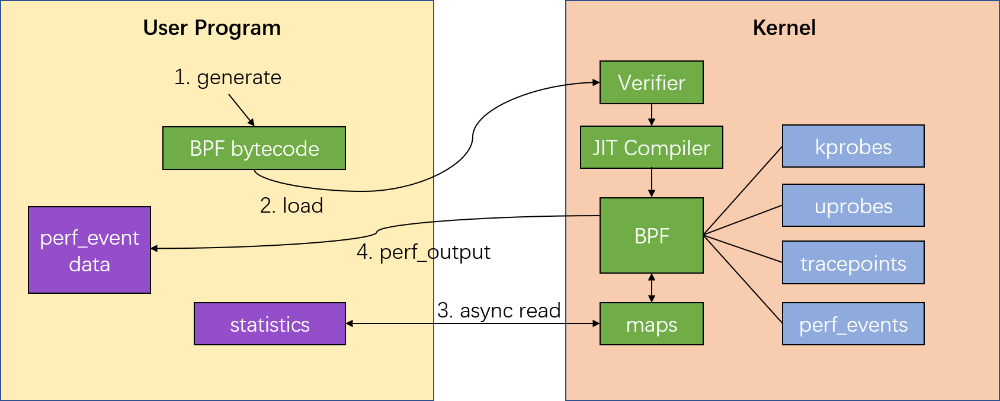
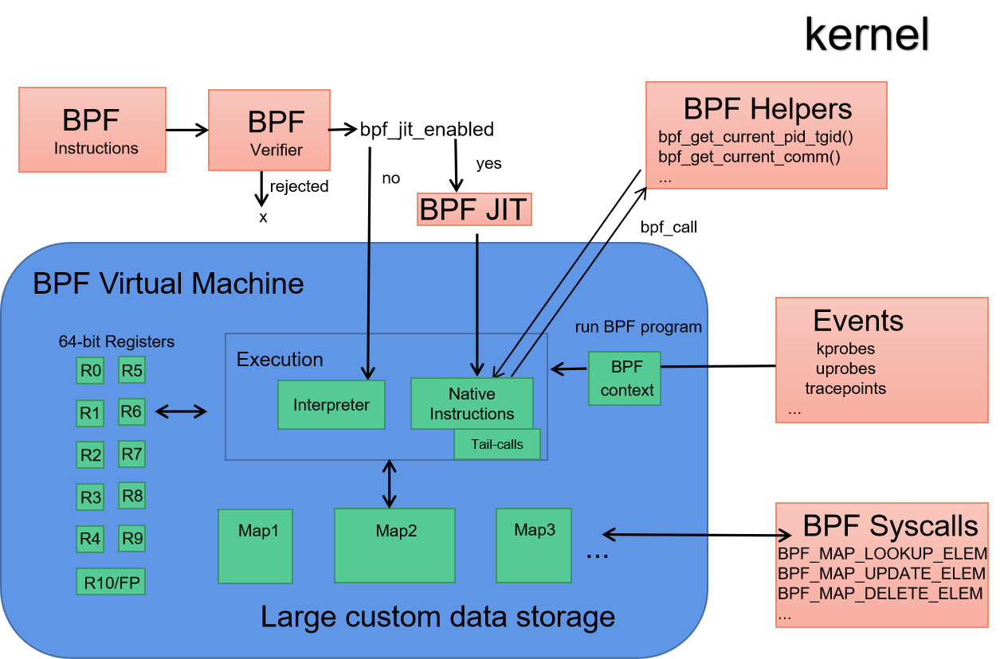

# eBPF编程

- [eBPF编程](#ebpf编程)
- [TLDR](#tldr)
- [1 Linux跟踪机制介绍](#1-linux跟踪机制介绍)
  - [1.1 数据采集方法（Data Sources）](#11-数据采集方法data-sources)
  - [1.2 数据的加工与传递手段（Mechanisms for Collection your Delicious Data），](#12-数据的加工与传递手段mechanisms-for-collection-your-delicious-data)
  - [1.3 用户前端工具（User Frontends）](#13-用户前端工具user-frontends)
  - [1.4 总结](#14-总结)
- [2 eBPF介绍](#2-ebpf介绍)
  - [2.1 eBPF基础](#21-ebpf基础)
    - [BPF sysctls https://docs.cilium.io/en/v1.13/bpf/architecture/#bpf-sysctls](#bpf-sysctls-httpsdocsciliumioenv113bpfarchitecturebpf-sysctls)
  - [2.2 eBPF组件](#22-ebpf组件)
    - [2.2.1 eBPF程序运行流程](#221-ebpf程序运行流程)
    - [2.2.2 eBPF沙箱](#222-ebpf沙箱)
    - [2.2.3 eBPF溯源](#223-ebpf溯源)
  - [2.3 eBPF对象生命周期（refcnt）](#23-ebpf对象生命周期refcnt)
    - [2.3.1 短生命周期](#231-短生命周期)
    - [2.3.2 长生命周期](#232-长生命周期)
  - [2.4 eBPF开发工具链](#24-ebpf开发工具链)
  - [2.5 eBPF CO-RE(Compile Once – Run Everywhere)](#25-ebpf-co-recompile-once--run-everywhere)
  - [2.6 eBPF限制](#26-ebpf限制)
- [3 使用libbpf开发eBPF程序](#3-使用libbpf开发ebpf程序)
  - [编程要点：](#编程要点)
  - [3.1 代码框架](#31-代码框架)
    - [3.1.1 编译](#311-编译)
    - [3.1.1 BPF skeleton 介绍](#311-bpf-skeleton-介绍)
    - [3.1.2 查看内核已经安装的bpf程序](#312-查看内核已经安装的bpf程序)
    - [3.1.3 调试eBPF内核代码](#313-调试ebpf内核代码)
  - [3.2 内核空间代码：头文件](#32-内核空间代码头文件)
    - [3.2.1 生成带所有内核类型的头文件vmlinux.h](#321-生成带所有内核类型的头文件vmlinuxh)
    - [3.2.2 内核代码需要的头文件](#322-内核代码需要的头文件)
  - [3.3 内核空间代码：全局变量](#33-内核空间代码全局变量)
  - [3.4 内核空间代码：SEC](#34-内核空间代码sec)
    - [3.4.1 用户态SEC](#341-用户态sec)
    - [3.4.2 SEC("license")](#342-seclicense)
  - [3.5 内核空间代码：查看内核hook点](#35-内核空间代码查看内核hook点)
    - [3.5.1 列出内核函数、内核跟踪点或性能事件](#351-列出内核函数内核跟踪点或性能事件)
    - [3.5.2 获取内核函数、跟踪点、事件调用方式](#352-获取内核函数跟踪点事件调用方式)
  - [3.6 内核空间代码：跟踪用户进程](#36-内核空间代码跟踪用户进程)
    - [3.6.1 获取用户进程hook点](#361-获取用户进程hook点)
  - [3.7 内核空间代码：实现CO-RE](#37-内核空间代码实现co-re)
    - [3.7.1 字段重定位使得可以从内核中抽取数据](#371-字段重定位使得可以从内核中抽取数据)
    - [3.7.2 Kconfig外部变量允许BPF程序适应各种内核版本以及特定配置的更改](#372-kconfig外部变量允许bpf程序适应各种内核版本以及特定配置的更改)
    - [3.7.3 只读的配置和struct flavors处理其他复杂场景](#373-只读的配置和struct-flavors处理其他复杂场景)
    - [3.7.4 使用全局变量](#374-使用全局变量)
  - [3.8 内核空间代码：BPF数据传递的桥梁，MAP与RING BUFFER](#38-内核空间代码bpf数据传递的桥梁map与ring-buffer)
  - [MAP](#map)
    - [3.8.1 定义MAP](#381-定义map)
    - [3.8.2 对 map 进行操作](#382-对-map-进行操作)
    - [3.8.3 pin map](#383-pin-map)
  - [RING BUFFER](#ring-buffer)
    - [3.8.4 内核空间代码：ring\_buffer - 另一种通讯方式](#384-内核空间代码ring_buffer---另一种通讯方式)
  - [3.9 内核空间代码：Helper Calls](#39-内核空间代码helper-calls)
    - [3.10 内核空间代码：Tail Calls](#310-内核空间代码tail-calls)
    - [3.11 内核空间代码：BPF to BPF Calls](#311-内核空间代码bpf-to-bpf-calls)
    - [3.12 内核空间代码：Object Pinning](#312-内核空间代码object-pinning)
  - [3.13 内核空间代码：加固](#313-内核空间代码加固)
  - [3.14 内核空间代码：Offloads](#314-内核空间代码offloads)
- [4 用户控制程序](#4-用户控制程序)
  - [4.1 头文件](#41-头文件)
  - [4.2 debug 方法](#42-debug-方法)
  - [4.3 从demo理解用户控制程序加载ebpf程序](#43-从demo理解用户控制程序加载ebpf程序)
    - [内核程序 hello.bpf.c](#内核程序-hellobpfc)
    - [用户控制程序 hello.c](#用户控制程序-helloc)
    - [makefile](#makefile)
  - [4.4 从demo理解用户控制程序与ebpf程序通信流程](#44-从demo理解用户控制程序与ebpf程序通信流程)
    - [cpudist.bpf.c](#cpudistbpfc)
    - [cpudist.c](#cpudistc)
- [REF](#ref)

# TLDR
eBPF是Linux Kernel引入的新功能，它提供另一种高效编程机制(提供一种动态语言，并且在kernel执行前先用JIT编译成本地语言)，可以在内核和用户态运行动态指令，避免了以前kernel编程时跟kernel版本和CPU体系架构绑定的缺点，大大提高了程序的可移植性。这高效编程可以用于制作探针，或是处理网络封包，而eBPF还在继续发展中。
使用eBPF技术可以应用在很多场景中:  
- 网络封包处理：XDP、TC、socket progs、kcm、calico、cilium等, 在现代数据中心和云原生环境中提供高性能的网络和负载平衡
- 内核跟踪和性能监控：KProbes、UProbes、TracePoints
- 安全领域：Secomp、landlock、tracee等。例如阻止部分类型的系统调用。

# 1 Linux跟踪机制介绍
Linux跟踪机制可以分成：
* 数据采集方法（Data Sources）
* 数据的加工与传递手段（Mechanisms for Collection your Delicious Data），
* 用户前端工具（User Frontends）  

## 1.1 数据采集方法（Data Sources）
  包括： kprobe, uprobe, tracepoint, USDT, perf event
  - *kprobe/uprobe* : probe 代指能够在程序运行时动态地修改指令，从而实现 tracing 的机制。kprobe（修改内核指令） /uprobe（修改用户态指令） 可用于 hook 函数体的任意位置，kretprobe /uretprobe 则专门用来 hook 函数的返回地址。他们都利用了 CPU 提供的单步调试指令（x86 即 int 3，1 字节的 0xcc 指令）来实现。
  - *tracepoint/USDT* : tracepoint 为编译器在编译时插入代码段的一条指令，程序在运行时能够利用这条指令实现跳转。它分为用于 kernel 的 tracepoint、用于 application 的 USDT。GCC 允许在编译程序时添加参数 -pg 令编译出来的程序在每一个函数起始处自动插入 5 字节的 call mcount 指令（AMD64 为 push rbp 之后），从而实现函数的入口与返回时的 hook。
  - *perf event* : 是基于硬件 performance monitoring counter（PMC）实现的数据获取方式。  

## 1.2 数据的加工与传递手段（Mechanisms for Collection your Delicious Data），
  包括：ftrace, tracer, trace events, tracepoint-based events, kprobe-based events, uprobe-based events, perf events, eBPF
  - *ftrace* : 更精确地称呼为 function tracer，能够用来追踪函数的调用情况。在历史上 function tracer 由 ftrace 重命名而来，而 ftrace 发展发展成为一种能够支持多类 tracing utilities 的框架，它基于 dynamic tracepoint，由 ftrace ring buffer、tracefs 构成该框架的核心。在 ftrace 框架下实现的各类 tracer，具体实现了 tracing 的行为，用于探测 kernel 中发生了什么，他们使用 trace_print() 将探测得到的数据写入 ftrace ring buffer 中，用户则可以通过读取 tracefs 中的 trace 或 trace_pipe 得到相关的数据。
  - *trace* ： 狭义上的 tracer 指的是 tracefs 中文件 available_tracers 所显示的那些，比如可绘制出函数调用关系的 function graph tracer；广义上的 tracer，包含了各类加工数据的方法，比如 trace events，eBPF tracer。
  - *trace events/tracepoint-based events/kprobe-based events/uprobe-based events* : trace events 是 kernel 中预定义的、用于传递 tracing 到的数据的一种行为，利用了 tracefs 向用户传递数据。有使用了 static tracepoint 的 tracepoint-based events、使用了 kprobe 的 kprobe-based events、使用了 uprobe 的 uprobe-based events 三类，后两种合称为 dynamic events。  
  kprobe 提供了 register_kprobe() 系列 API，允许用户编写 kernel modules、注册 hook 点的 pre-handler 与 post-handler 回调函数用以处理捕获到的数据。uprobe 虽然也有类似 kprobe 的 register_uprobe_event()API，但它不对用户暴露。
  - *perf events*: 不同于 trace events，使用 perf events（performance events）采集到的数据能够用来衡量性能，它最初名为 performance counter，使用的是 PMU 获取数据，后来它能够利用的数据获取方式不再局限为 PMU，亦发展称为一种框架，实现了类似 trace ring buffer 的 perf ring buffer，perf ring buffer 种的数据能够通过 perf_event_open() 系统调用传递给用户。当前它包括使用硬件 PMC 实现的 hardware events、基于 kernel counter 实现的 software events、使用了 tracepoint 的 tracepoint events。
  - eBPF（extended BPF）最初由过滤网络数据包的 BPF 发展而来，它是 kernel 内部的虚拟机，eBPF 程序能够对 tracepoint、kprobe、uprobe、USDT 探测得到数据进行处理，使用 tracefs、`perf_event_open ()，或 eBPF maps 将数据传递给用户。eBPF maps 是一种用于运行在 kernel 中的 eBPF 程序存储数据的方法，使用它还能够令 eBPF 程序与 userspace 中的 application 之间共享数据。  
  
  有三种方法在内核态和用户态之间传递tracing数据：
  - tracefs：使用 ftrace ring buffer 存储数据，通过读取文件 trace / trace_pipe 取得数据
  - perf_event_open(): 使用 perf ring buffer 存储数据，通过系统调用 perf_event_open() 取得数据
  - eBPF maps: eBPF 程序采用的数据存储方式，使用 bpf_map_lookup_elem() / bpf_map_update_elem() / bpf_map_delete_elem() API 令 eBPF program 与 application 进行双向通信

## 1.3 用户前端工具（User Frontends）  
  包括： systemtap (stap), trace-cmd, perf, LLTng, Dtrace, bcc, bpftrace  
  [各工具技术原理]https://events.static.linuxfound.org/sites/events/files/slides/LinuxConJapan2015-DynamicProbes.pdf
  现在常用的是:
  - perf: 性能统计工具,通过CPU内建的PMC进行打点采样。
  - ftrace: 函数性能跟踪工具，提供跟踪内核函数调用、对上下文切换进行跟踪、查看中断被关闭的时长、跟踪内核态中的延迟以及性能问题等功能。是利用gcc编译器在编译时在每个函数的入口地址放置一个probe点实现，从而保证高性能。probe点把信息通过probe函数给送到ring buffer中，再由暴露在用户态debufs实现相关控制。
  - 基于ebpf的工具, [这些工具主要包括](https://www.brendangregg.com/ebpf.html)：
    - bcc: 基于python的ebpf开发工具以及对应的跟踪软件。
    - bpftrace: 使用ebpf技术实现的跟踪工具，可以自定义跟踪操作。

## 1.4 总结
- kprobe、uprobe 能够 hook 函数代码中的任意位置，一个用于 kernel，一个用于 application
- tracepoint 是埋在代码中的静态 hook 点
- ftrace 是框架，使用 dynamic tracepoint，利用 tracer 处理数据，使用 tracefs 输出数据
- 广义上的 tracer 是数据加工的方式
- trace events 是一种输出捕获得到的数据的模板，使用 tracefs 输出数据，根据数据的获取方式分为 tracepoint-based events、probe-based events、uprobe-based events 三类
- perf events 采集到的数据用于衡量性能，亦发展称为一种框架
- USDT 是用来 trace ELF binary application 的，用来 trace 解释型语言的是 dynamic USDT

---

# 2 eBPF介绍
## 2.1 eBPF基础
BPF全称是「Berkeley Packet Filter」，翻译过来是「伯克利包过滤器」,最初是为了在 Unix 内核实现网络数据包过滤，这种新的技术比当时最先进的数据包过滤技术快 20 倍。BPF 在数据包过滤上引入了两大革新：  
- 一个新的虚拟机 (VM) 设计，可以有效地工作在基于寄存器结构的 CPU 之上；  
  BPF虚拟机不同于虚拟化，它是一个RISC指令, 带有寄存器的虚拟机, 内部有11个64位寄存器, 一个程序计数器(PC), 以及一个512字节的固定大小的栈。
- 应用程序使用缓存只复制与过滤数据包相关的数据，不会复制数据包的所有信息，最大程度地减少BPF 处理的数据，提高处理效率； 

eBPF（extended Berkeley Packet Filter，扩展的伯克利数据包过滤器）是在2014年引入Linux内核中的一项新技术，在BPF的基础上进行了扩展。 它相对BPF(旧的BPF也叫 cBPF, classic BPF)有如下增强：
- 使用类似于X86的体系结构，eBPF设计了一个通用的RISC指令集，支持11个64bit寄存器（32bit子寄存器）r0-r10，使用512字节的栈空间
- 引入了JIT编译，取代了BPF解释器。eBPF程序直接被编译为目标体系结构的机器码
- 和网络子系统进行了解耦。它的数据模型是通用的，eBPF程序可以挂钩到 Kprobe或 Tracepoint
- 使用Maps来存储全局数据，这是一种通用的键值存储。可用作不同eBPF程序、eBPF和用户空间程序的状态共享
- 助手函数（Helper Functions），这些函数供eBPF程序调用，可以实现封包改写、Checksum计算、封包克隆等能力
- 尾调用（Tail Calls），可以用于将程序控制权从一个eBPF转移给另外一个。老版本的eBPF对程序长度有4096字节的限制，通过尾调用可以规避
- 用于Pin对象（Maps、eBPF程序）的伪文件系统
- 支持将eBPF Offload给智能硬件的基础设施

相对其他内核编程，它有如下特点： 
- eBPF 具有非常好的灵活性、动态性，可以随时的注入、卸载，不需要重启内核或者中断网络连接。它可以通过热加载的sandbox程序到内核中而不需要insmod module的方式，避免内核模块的方式可能会引入宕机风险，并具备堪比原生代码的执行效率。  
- eBPF程序可以在不同体系结构之间移植。
- eBPF程序不会引起系统宕机，Just-In-Time (JIT) compiler编译器假设代码是安全但有 verification engine从汇编语言级别检查程序的有效性，程序中规定了内存范围、有限的循环、bpf_spin_lock()不会死锁、不可以在free之后使用、不可以有内存泄露等。
- 随着Linux内核的发展，eBPF的功能也不断扩展和改进。2015年，eBPF得到了持续集成（Continuous Integration，CI）的支持，使得它可以更加容易地被开发人员使用。2016年，eBPF的支持被扩展到了更多的内核子系统，包括文件系统、安全子系统和内存管理。2019年，eBPF的性能得到了进一步提升，并且可以用于更广泛的用途，如安全审计和调试。  


eBPF解决了这些问题：
- 强安全: BPF验证器（verifier）会保证每个程序能够安全运行，它会去检查将要运行到内核空间的程序的每一行是否安全可靠，如果检查不通过，它将拒绝这个程序被加载到内核中去，从而保证内核本身不会崩溃，这是不同于开发内核模块的。比如以下几种情况是无法通过的BPF验证器的：
    - 没有实际加载BPF程序所需的权限
    - 访问任意内核空间的内存数据
    - 将任意内核空间的内存数据暴露给用户空间
    BPF验证机制很像Chrome浏览器对于Javascript脚本的沙盒机制。
- 高性能: 一旦通过了BPF验证器，那么它就会进入JIT编译阶段，利用Just-In-Time编译器，编译生成的是通用的字节码，它是完全可移植的，可以在x86和ARM等任意球CPU架构上加载这个字节码，这样我们能获得本地编译后的程序运行速度，而且是安全可靠的。
- 持续交付: 通过JIT编译后，就会把编译后的程序附加到内核中各种系统调用的钩子（hook）上，而且可以在不影响系统运行的情况下，实时在线地替换这些运行在Linux内核中的BPF程序。可以预见到的结果是，上一个数据包是旧版本的程序在处理，而下一个数据包就会看到新版本的程序了，没有任何的中断。这就是无缝升级，从而实现持续交付的能力。

使用eBPF技术可以应用在很多场景中:  
- 网络封包处理：XDP、TC、socket progs、kcm、calico、cilium等, 在现代数据中心和云原生环境中提供高性能的网络和负载平衡
- 内核跟踪和性能监控：KProbes、UProbes、TracePoints
- 安全领域：Secomp、landlock、tracee等。例如阻止部分类型的系统调用

它以低开销提取细粒度的安全可观察数据，帮助应用程序开发人员跟踪应用程序，提供性能故障排除、应用程序和容器运行时安全实施的见解等。 

目前，eBPF已经成为了Linux内核中的一个重要技术，广泛应用于各种领域，如网络、安全、云计算、容器和服务器监控等。  

### BPF sysctls https://docs.cilium.io/en/v1.13/bpf/architecture/#bpf-sysctls
The Linux kernel provides few sysctls that are BPF related and covered in this section.

- /proc/sys/net/core/bpf_jit_enable: Enables or disables the BPF JIT compiler.
  | Value | Description  |
  | ------|--------------|
  | 0     | Disable the JIT and use only interpreter (kernel’s default value)  |
  | 1     | Enable the JIT compiler  |
  | 2     | Enable the JIT and emit debugging traces to the kernel log  |

  As described in subsequent sections, bpf_jit_disasm tool can be used to process debugging traces when the JIT compiler is set to debugging mode (option 2).

- /proc/sys/net/core/bpf_jit_harden: Enables or disables BPF JIT hardening. Note that enabling hardening trades off performance, but can mitigate JIT spraying by blinding out the BPF program’s immediate values. For programs processed through the interpreter, blinding of immediate values is not needed / performed.

  | Value | Description   |
  |-------|---------------|
  | 0     | Disable JIT hardening (kernel’s default value) |
  | 1     | Enable JIT hardening for unprivileged users only |
  | 2     | Enable JIT hardening for all users |

- /proc/sys/net/core/bpf_jit_kallsyms: Enables or disables export of JITed programs as kernel symbols to /proc/kallsyms so that they can be used together with perf tooling as well as making these addresses aware to the kernel for stack unwinding, for example, used in dumping stack traces. The symbol names contain the BPF program tag (bpf_prog_<tag>). If bpf_jit_harden is enabled, then this feature is disabled.

  | Value | Description   |
  |-------|---------------|
  | 0     | Disable JIT kallsyms export (kernel’s default value) |
  | 1     | Enable JIT kallsyms export for privileged users only |

- /proc/sys/kernel/unprivileged_bpf_disabled: Enables or disable unprivileged use of the bpf(2) system call. The Linux kernel has unprivileged use of bpf(2) enabled by default, but once the switch is flipped, unprivileged use will be permanently disabled until the next reboot. This sysctl knob is a one-time switch, meaning if once set, then neither an application nor an admin can reset the value anymore. This knob does not affect any cBPF programs such as seccomp or traditional socket filters that do not use the bpf(2) system call for loading the program into the kernel.

  | Value | Description   |
  |-------|---------------|
  | 0     | Unprivileged use of bpf syscall enabled (kernel’s default value) |
  | 1     | Unprivileged use of bpf syscall disabled  |

## 2.2 eBPF组件
一个eBPF程序的主要构成部分：


1. 用户空间的BPF字节码：用户空间的BPF程序，文件名一般是xxx.bpf.c，由该文件生成BPF字节码

2. 用户空间的程序代码：表述从内核获取数据后的处理逻辑。当程序挂载的系统调用被触发，就会把相应的事件数据传输到perf_event data中，由用户空间的代码来分析行为。

3. 内核空间的verifier: 验证器确保了eBPF程序可以安全运行。它验证程序是否满足几个条件，例如:
   - 加载eBPF程序的流程拥有所需的功能(特权)
   - 程序不会崩溃或以其他方式损害系统
   - 程序不能使用任何未初始化的变量或越界访问内存
   - 程序必须符合系统的尺寸要求，不可能加载任意大的eBPF程序
   - 程序必须具有有限的复杂性。验证者将评估所有可能的执行路径，并且必须能够在配置的复杂度上限范围内完成分析
   - 程序总是运行到结束，即没有死循环  
4. 内核空间的JIT Compiler：即时(JIT)编译步骤将程序的通用字节码转换为特定于机器的指令集，以优化程序的执行速度。这使得eBPF程序可以像本地编译的内核代码或作为内核模块加载的代码一样高效地运行。

5. 内核空间的BPF沙箱程序：这是整个程序的核心部分，BPF程序可以被挂载到多种系统点：kprobe、uprobe、tracepoint和perf_events. 至于你关注的系统调用属于那种系统hook点，可以用 bpftrace -l 命令来查询。当程序挂载的系统调用被触发，就会把相应的事件数据传输到perf_event data中.

6. 内核空间的MAPS：eBPF非常重要的能力是能分享收集到的信息并存储状态。为了达到这个目的，eBPF使用maps来存储数据。这些数据可以是各种各样的struct. Maps中的数据可以被用户空间的程序通过系统调用读取。

### 2.2.1 eBPF程序运行流程
然后再来看一个eBPF程序的主要流程： 
1. 编写BPF代码，生成字节码
2. 加载BPF字节码到内核上
3. 异步读取maps数据
4. 系统事件触发，用户空间接收到事件信息开始处理分析逻辑

### 2.2.2 eBPF沙箱

它是一副eBPF沙箱架构图，都是在内核中的。这个图中较为具体的展示了BPF虚拟机的构造以及其和外部组件的关系。eBPF虚拟机是一个RISC指令, 带有寄存器的虚拟机, 内部有11个64位寄存器, 一个程序计数器(PC), 以及一个512字节的固定大小的栈。这里有图1没有显示出来的 BPF Helpers函数和十一个寄存器。你可以通过 `bpftool feature probe ` 查看支持的helpers函数。这里稍微展开说一下这11个寄存器：

- r0: 保存函数调用和当前程序退出的返回值
- r1~r5: 作为函数调用参数, 当程序开始运行时, r1包含一个指向context参数的指针。
- r6~r9: 在内核函数调用之间得到保留
- r10: 只读的指向512字节栈的栈指针   

对于eBPF到eBPF, eBPF到内核, 每个函数调用最多5个参数, 保存在寄存器r1~r5中. 并且传递参数时, 寄存器r1~r5只能保存常数或者指向堆栈的指针, 不能是任意内存的指针. 所有的内存访问必须先把数据加载到eBPF堆栈中, 然后才能使用. 这样的限制简化内存模型, 帮助eBPF验证器进行正确性检查。

其中，Tail-calls允许 eBPF 程序传入新的eBPF程序。已突破eBPF programs 必须小于等于 4096 bytes的限制.

### 2.2.3 eBPF溯源
安全工程师经常需要根据不同场景作不同的溯源策略。本文给的溯源方式中，都使用了eBPF的相关接口，这意味着：如果恶意程序比检查工具运行的早，那么对于结果存在伪造的可能。

## 2.3 eBPF对象生命周期（refcnt）


eBPF用户态程序与内核态程序交互，加载BPF字节码后，能退出吗？退出后，内核hook的BPF函数还工作吗？创建的map是否还存在？如果要回答这些问题，不得不提BPF程序的加载机制，BPF对象生命周期。

用户态程序通过文件描述符FD来访问BPF对象（progs、maps、调试信息），每个对象都有一个引用计数器。用户态打开、读取相应FD，对应计数器会增加。若FD关闭，引用计数器减少，当refcnt为0时，内核会释放BPF对象，那么这个BPF对象将不再工作。

在安全场景里，用户态的后门进程若退出后，后门的eBPF程序也随之退出。在做安全检查时，这可以作为一个有利特征，查看进程列表中是否包含可疑进程。

但并非所有BPF对象都会随着用户态进程退出而退出。从内核原理来看，只需要保证refcnt大于0，就可以让BPF对象存活，让后门进程持续工作了。其实在BPF的程序类型中，像XDP、TC和基于CGROUP的钩子是全局的，不会因为用户态程序退出而退出。相应FD会由内核维护，保证refcnt计数器不为零，从而继续工作。

### 2.3.1 短生命周期
BPF程序类型代表：
- k[ret]probe
- u[ret]probe
- tracepoint
- raw_tracepoint
- perf_event
- socket filters
- so_reuseport  

特点是基于FD管理，内核自动清理，对系统稳定性更好。这种程序类型的后门，在排查时特征明显，就是用户态进程。并且可以通过系统正在运行的BPF程序列表中获取。

### 2.3.2 长生命周期
BPF程序类型代表: 
- XDP
- TC
- LWT
- CGROUP


## 2.4 eBPF开发工具链

eBPF程序开发常使用的方法分为bcc、bpftrace、eBPF Go Library和libbpf. 

- BCC：BCC是一个框架，该框架使得用户可以写python程序来和eBPF内核函数交互，这些python程序内嵌了eBPF程序。运行python程序就可以生成eBPF字节码并把它们加载到内核。
- bpftrace：bpftrace是一种用于Linux eBPF的高级跟踪语音，在4.x及以上的内核中可用。bpftrace使用LLVM作为后端来编译脚本成eBPF字节码并使用BCC来和Linux eBPF子系统进行交互。bpftrace语言的灵感来自awk、C以及DTrace和SystemTap等早期跟踪程序。
- eBPF Go Library：eBPF Go库提供了一个通用的eBPF库，它将获取eBPF字节码的过程与eBPF程序的加载和管理分离开来。eBPF程序通常是通过编写高级语言创建的，然后使用clang/LLVM编译器编译成eBPF字节码。
- libbpf Library：libbpf 库是基于 C/C++ 的通用 eBPF 库，可以帮助把从clang/LLVM编译器生成的eBPF对象文件的加载解耦到内核，它通过为应用程序提供易于使用的API库来抽象化和BPF系统调用的交互操作。例如开源项目tracee就是使用的libbpf进行开发的，它使用的libbpfgo其实是对libbpf用go语言进行的封装。
 以上四种方法只是书写eBPF程序和生成eBPF字节码的方式不同，也就是图1的第一个步骤不同，其他的都是一致的。

## 2.5 eBPF CO-RE(Compile Once – Run Everywhere)
由于eBPF在内核sanbox中运行，但是不同内核的数据类型、数据结构等可能发生变化，这就带来可移植性问题。
为了保证一次编译，到处运行，eBPF也做了一定的工作：
- 不是所有的BPF程序都需要访问内部的内核数据结构。一个例子是opensnoop工具，这些不受可移植性影响。
- 内核内部的BPF机器提供了有限的“稳定接口”集，BPF程序可以依靠这些稳定接口在内核间保持稳定。事实上，不同版本的内核的底层结构和机制是会发生变化的，但BPF提供的稳定接口从用户程序中抽象了这些细节。

但有时候需要访问原始的内核数据(如经常会访问到的 struct task_struct，表示一个进程或线程，包含大量进程信息)，此时就只能靠自己了。跟踪，监视和分析应用程序通常是这种情况，这些应用程序是一类非常有用的BPF程序。
这时bcc的解决方案是将BPF程序的C代码以字符串的形式嵌入到用户空间的程序中，当程序最终部署并运行在目标主机上后，BCC会唤醒其嵌入的Clang/LLVM，提取本地内核头文件(必须确保已从正确的kernel-devel软件包中将其安装在系统上)，并即时进行编译。但是这有如下问题：
- 编译时的高资源利用率(内存和CPU)，在繁忙的服务器上时有可能干扰主流程。
- 依赖内核头文件包，不得不在每台目标主机上进行安装。即使这样，如果需要某些没有通过公共头文件暴露的内核内容时，需要将类型定义拷贝黏贴到BPF代码中，通过这种方式达成目的。
- 即使是很小的编译时错误也只能在运行时被检测到，之后不得不重新编译并重启用户层的应用；这大大影响了开发的迭代时间(并增加了挫败感...)

为此BPF CO-RE通过如下机制进行了如下改进：
- 使用BTF类型信息，用于允许获取关于内核和BPF程序类型和代码的关键信息，进而为解决BPF CO-RE的其他难题提供了可能性；
- 编译器(Clang)为BPF程序C代码提供了表达意图和记录重定位信息的方法；
- BPF加载器(libbpf)将内核和BPF程序中的BTF绑定在一起，用于将编译后的BPF代码调整为目标主机上的特定内核代码；
- 内核，在完全不依赖BPF CO-RE的情况下，提供了高级BPF功能来启用某些更高级的场景。

这些就是 libbpf的工作，将BPF程序视为一个普通的用户空间的程序：仅需要将其编译成一些小的二进制，然后不用经过修改就可以部署到目的主机上。libbpf扮演了BPF程序的加载器，负责配置工作(重定位，加载和校验BPF程序，创建BPF maps，附加到BPF钩子上等)，开发者仅需要关注BPF程序的正确性和性能即可。这种方式使得开销降到了最低，消除了大量依赖，提升了整体开发者的开发体验。

构建基于libbpf的BPF应用需要使用BPF CO-RE包含的几个步骤：

- 生成带所有内核类型的头文件vmlinux.h
- 使用Clang(版本10或更新版本)将BPF程序的源代码编译为.o对象文件
- 从编译好的BPF对象文件中生成BPF skeleton 头文件 (BPF skeleton 头文件内容来自上一步生成的.o文件，可以参考libbpf-tools的Makefile文件，可以看到 skeleton 头文件其实是通过bpftool gen命令生成的)
- 在用户空间代码中包含生成的BPF skeleton 头文件
- 最后，编译用户空间代码，这样会嵌入BPF对象代码，后续就不用发布单独的文件

这些可以在 libbpf的makefile里面看到。

## 2.6 eBPF限制
虽然eBPF功能强大，但是内核中的eBPF技术还是使用了很多限制以确保内核处理的安全和及时。但是随着技术的发展和演进，这些限制可能会逐步放宽或者提供了相应的解决方案:

* eBPF程序并不能随意调用内核参数，而是仅仅限制在内核模块列出的 BPF Helper 函数。不过这个支持函数列表随着内核发展而增长
* eBPF 程序不允许包含无法访问的指令，以防止加载无效代码和延迟程序终止
* eBPF 程序中的循环数量是有限的，并且必须在有限的时间内结束，这主要用于防止在 kprobes 中插入任意循环，从而导致锁定整个系统
  * 解决方案包括扩展循环和为需要循环的常见用途添加辅助函数
  * Linux 5.3 在 BPF 中包含对有界循环的支持，它在运行时具有可验证的上限
* eBPF 堆栈大小限制为 MAX_BPF_STACK ，这个值从内核5.8开始设置为 512 ; 详细参考 include/linux/filter.h
  * 当在堆栈上存储多个字符串缓冲区时，此限制特别相关: 一个 char[256] 缓冲区将消耗此堆栈的一半
  * 注意: 没有增加这个限制的计划 – 解决方案是切换到 bpf 映射存储，这实际上是无限的
* eBPF字节码大小最初限制为 4096 条指令，但从内核 Linux 5.8 开始，现在已经放宽到 100 万条指令（ BPF_COMPLEXITY_LIMIT_INSNS ）详细参考 include/linux/bpf.h
  * 4096 条指令限制（ BPF_MAXINSNS ）仍然是 保留给非特权 BPF 程序
  * 新版本的eBPF还支持级联调用多个eBPF程序(不过传递信息方面存在一定限制)，可以组合起来实现更多强大功能

---

# 3 使用libbpf开发eBPF程序
## 编程要点：
- 可以访问辅助函数、上下文对象  
  除了辅助函数之外，BPF程序不能发起任何函数调用，因此公共库代码需要实现为内联函数。此外LLVM提供的一些builtins可以被使用，并且总是保证被内联   
  辅助函数（Helper functions）使得 BPF 能够通过一组内核定义的函数调用（function call）来从内核中查询数据，或者将数据推送到内核。不同类型的 BPF 程序能够使用的 辅助函数可能是不同的，例如，与 attach 到 tc 层的 BPF 程序相比，attach 到 socket 的 BPF程序只能够调用前者可以调用的辅助函数的一个子集。另外一个例子是， 轻量级隧道（lightweight tunneling ）使用的封装和解封装（Encapsulation and decapsulation）辅助函数，只能被更低的 tc 层（lower tc layers）使用；而推送通知到 用户态所使用的事件输出辅助函数，既可以被 tc 程序使用也可以被 XDP 程序使用。  

  所有的辅助函数都共享同一个通用的、和系统调用类似的函数签名。签名定义如下：
  ```c
    u64 fn(u64 r1, u64 r2, u64 r3, u64 r4, u64 r5)
  ```

  内核将辅助函数抽象成 BPF_CALL_0() 到 BPF_CALL_5() 几个宏，形式和相应类型的系 统调用类似。下面的例子是从某个辅助函数中抽取出来的，可以看到它通过调用相应 map 的回调函数完成更新 map 元素的操作：
  ```c
    BPF_CALL_4(bpf_map_update_elem, struct bpf_map *, map, void *, key,
              void *, value, u64, flags)
    {
        WARN_ON_ONCE(!rcu_read_lock_held());
        return map->ops->map_update_elem(map, key, value, flags);
    }

    const struct bpf_func_proto bpf_map_update_elem_proto = {
        .func           = bpf_map_update_elem,
        .gpl_only       = false,
        .ret_type       = RET_INTEGER,
        .arg1_type      = ARG_CONST_MAP_PTR,
        .arg2_type      = ARG_PTR_TO_MAP_KEY,
        .arg3_type      = ARG_PTR_TO_MAP_VALUE,
        .arg4_type      = ARG_ANYTHING,
    };
  ```

- 程序的入口点通过SEC来指定，而非main函数
  BPF ELF loader通过段的名字来抽取、准备相关的信息，以便载入程序和Map。

- 在对象文件中包含多个入口点是允许的
- 所有库函数调用被内联（__always_inline），因而运行时不存在函数调用的开销。非内联的global函数从5.5+开始被支持。
- 没有全局变量（5.5-）
  除非内核版本在5.5+以上，BPF程序中没有普通C程序中的全局变量。5.5+的全局变量底层仍然是基于BPF Map实现的。  
  作为变通方案，可以使用BPF_MAP_TYPE_PERCPU_ARRAY类型的Map，这种Map为每个CPU核心存储一个任意大小的值。由于BPF程序在运行过程中绝不会被抢占，在此Map中初始化一个临时的缓冲区（例如为了突破栈的大小限制）用作全局变量是安全的。在发生尾调用的情况下也不会发生抢占，Map的内容不会消失。  
  对于任何需要跨越多次BPF程序运行保存的状态，都使用普通BPF Map即可。

- 有限循环
  - 旧版本使用`pragma unroll`展开循环，但是会增大代码段大小：
    ```c
    #pragma unroll
      for (int i = 0; i < 100; i++) {
          bpf_printk("Hello");
      }
    ```

  - 新版本verifier 通过模拟 loops 的运行状态，从而判断 loops 是否能够在有限时间内结束运行。但是这个判断并不一定准确，有些时候，哪怕从代码角度来看，loops 是安全的，verifier 可能也会将其拒绝。

  - 然后还可以使用`bpf_loop` helper 函数, 可让 loop_fn 执行 iterations 次:
    ```c
    long bpf_loop(u32 iterations, long (*loop_fn)(u32 index, void *ctx),
    		  void *ctx, u64 flags);
    ```

- 常量和全局变量的访问
  epbf程序能够直接访问常量和全局变量。常量定义应该包括 volatile 以避免编译器优化：
  ```c
  const volatile unsigned long long min_duration_ns = 0;
  ```
  但是从用户空间，它们只能通过 BPF skeleton 读取和更新：
  ```c
  skel->rodata 用于只读变量；
  skel->bss 用于可变的零初始化变量；
  skel->data 用于非零初始化的可变变量。
  skel->rodata->min_duration_ns = env.min_duration_ms * 1000000ULL; // 初始化上面定义的min_duration_ns，必须在skeleton open后,skeleton load前

  ```

- LLVM的内置函数一般是可用的、并且被内联
  ```c
  #ifndef memset
  # define memset(dest, chr, n)   __builtin_memset((dest), (chr), (n))
  #endif
  
  #ifndef memcpy
  # define memcpy(dest, src, n)   __builtin_memcpy((dest), (src), (n))
  #endif
  ```
- 栈空间大小限制为512字节
  BPF程序的栈空间仅有512字节，因此编码时需要小心。要使用一个较大的缓冲区，可以从BPF_MAP_TYPE_PERCPU_ARRAY类型的Map分配。

- 无效引用问题
  诸如bpf_skb_store_bytes之类的助手函数，会导致封包的size发生变化。由于Verifier无法在运行时跟踪这种变化，因此一旦调用了这类助手函数，对数据的引用（指针）立刻会被Verifer无效化（invalidated）：

  ```c
  struct iphdr *ip4 = (struct iphdr *) skb->data + ETH_HLEN;
  
  skb_store_bytes(skb, l3_off + offsetof(struct iphdr, saddr), &new_saddr, 4, 0);
  
  // Verifier会拒绝下面的代码，因为此处ip4这个指针已经无效了，不能解引用
  if (ip4->protocol == IPPROTO_TCP) {
      // do something
  }
  ```
  解决办法是重新获取引用：

  ```c
  struct iphdr *ip4 = (struct iphdr *) skb->data + ETH_HLEN;
  
  skb_store_bytes(skb, l3_off + offsetof(struct iphdr, saddr), &new_saddr, 4, 0);
  
  // 重新获取引用
  ip4 = (struct iphdr *) skb->data + ETH_HLEN;
  
  if (ip4->protocol == IPPROTO_TCP) {
      // do something
  }
  ```


## 3.1 代码框架
以下介绍使用 libbpf开发eBPF程序。eBPF程序运行于内核的sanbox中，只能调用有限的内核API（BPF Helper函数），具体见上面eBPF限制。
一个典型的ePBF应用包括：  
- [Makefile](./demo/Makefile)  : 利用libbpf工具编译并生成用户态ebpf程序  
- [内核ebpf程序](./demo/hello.bpf.c)  ：使用eBPF功能，libbpf会根据它创建 .skel.h, 让用户态ebpf控制程序可以加载ebpf代码  
- [用户态ebpf控制程序](./demo/hello.c)  : 最终发布程序，代码中引用 .skel.h 实现 ebpf的动态加载功能。  

### 3.1.1 编译
使用 BPF CO-RE 构建基于 libbpf 的 BPF 应用程序包括以下几个步骤：

- 生成包含所有内核类型的 vmlinux.h 头文件；
- 使用最新的 Clang（版本 10 或更新版本）将 BPF 程序源代码编译为 .o 目标文件；
- 从已编译的 BPF 目标文件生成 BPF skeleton 头文件；
- 包含生成的 BPF skeleton 头文件，以便从用户空间代码使用；
- 然后，最后编译用户空间代码。
  将BPF skeleton（头文件）包含到你的用户空间控制程序中，获得打开、加载、挂钩BPF程序，以及修改BPF对象等能力。
  这会将 BPF 目标代码嵌入其中，这样你就不必随应用程序分发额外的文件。
- 运行时用户空间通过eBPF Map和内核空间交换数据，获知eBPF程序的执行结果。

编译 BPF 代码并生成 BPF skeleton 时，在用户空间代码中包含 libbpf 和 skeleton 头文件，以便使用必要的 API：
```
#include <bpf/bpf.h>
#include <bpf/libbpf.h>
#include "path/to/your/skeleton.skel.h"
```

### 3.1.1 BPF skeleton 介绍
BPF Skeleton 是一个 EBPF 的开发框架，它可以快速搭建 EBPF 项目的骨架。BPF Skeleton 提供了一些常用的模板代码，包括内核模块的初始化和清理、BPF Map 的初始化和清理、BPF Program 的加载和卸载、BPF 事件的处理等。使用 BPF Skeleton 可以让开发人员更快地编写高质量的 EBPF 程序，并且减少出错的可能性。
生成命令：
```c
bpftool gen skeleton my_prog_name.bpf.o
```

BPF Skeleton 的核心是一个名为 bpf_prog_skel 的结构体，它是一个 BPF Program 的骨架。在使用 BPF Skeleton 时，开发人员可以通过实例化 bpf_prog_skel 结构体来创建自己的 BPF Program。BPF Skeleton 还提供了一些回调函数，可以让开发人员在 BPF Program 执行过程中执行一些特定的操作。

生成的 BPF skeleton 有相应的函数来实现每个阶段的触发：
```c
<my_prog_name>__open()    – 创建并打开 BPF 应用程序；
<my_prog_name>__load()    – 实例化、加载和验证 BPF 应用程序部分；
<my_prog_name>__attach()  – 附加所有可自动附加的 BPF 程序（它是可选的，你可以通过直接使用 libbpf API 获得更多控制）；
<my_prog_name>__destroy() – 分离所有BPF 程序并释放所有使用的资源。
```
<my_prog_name>__open() 会返回一个 Skeleton 对象，应用程序可以通过这个对象初始化内核中 eBPF代码的值。
```c
skel->rodata 用于只读变量；
skel->bss 用于初始值为0的可变量；
skel->data用于初始值非0的可变量。
```

使用const volatile声明的全局变量min_us和targ_pid位于.rodata(read-only)段，用户空间的应用可以在加载BPF程序前读取或更新BPF侧的全局变量，下面是例子：
```c
struct <name> *skel = <name>__open();
if (!skel)
    /* handle errors */

skel->rodata->my_cfg.feature_enabled = true;
skel->rodata->my_cfg.pid_to_filter = 123;

if (<name>__load(skel))
    /* handle errors */
```

Skeleton 可以用于大部分场景，但有一个例外：perf events。这种情况下，不能使用struct <name>__bpf中的links，而应该自定义一个struct bpf_link *links[]，原因是perf_event需要在每个CPU上进行操作。例如llcstat.c
```c
static int open_and_attach_perf_event(__u64 config, int period,
				struct bpf_program *prog,
				struct bpf_link *links[])
{
	struct perf_event_attr attr = {
		.type = PERF_TYPE_HARDWARE,
		.freq = 0,
		.sample_period = period,
		.config = config,
	};
	int i, fd;

	for (i = 0; i < nr_cpus; i++) {
		fd = syscall(__NR_perf_event_open, &attr, -1, i, -1, 0);
		if (fd < 0) {
			fprintf(stderr, "failed to init perf sampling: %s\n",
				strerror(errno));
			return -1;
		}
		links[i] = bpf_program__attach_perf_event(prog, fd);
		if (libbpf_get_error(links[i])) {
			fprintf(stderr, "failed to attach perf event on cpu: "
				"%d\n", i);
			links[i] = NULL;
			close(fd);
			return -1;
		}
	}
	return 0;
}
```


### 3.1.2 查看内核已经安装的bpf程序
```json
bpftool prog -p
  [{
          "id": 3,
          "type": "cgroup_device",
          "name": "sd_devices",
          "tag": "3650d9673c54ce30",
          "gpl_compatible": true,
          "loaded_at": 1675994111,
          "uid": 0,
          "bytes_xlated": 504,
          "jited": true,
          "bytes_jited": 310,
          "bytes_memlock": 4096
      },{
   ...
```

### 3.1.3 调试eBPF内核代码
bpf_trace_printk() 将 msg 写入 tracefs 的 ring buffer 中，bpf_trace_printk() 最多可接收三个参数进行格式化输出。
bpf_trace_printk() 支持 libc 的 printf() 实现的有限子集。 诸如 %s、%d 和 %c 之类的基本内容有效，但是，比如说，位置参数 (%1$s) 无效。 参数宽度说明符（%10d、%-20s 等）仅适用于最近的内核，但不适用于较早的内核。 此外，还支持一堆特定于内核的修饰符（如 %pi6 打印出 IPv6 地址或 %pks 内核字符串）。
如果格式字符串无效或使用不受支持的功能，bpf_trace_printk() 将返回负错误代码。
```c
/**
 * long bpf_trace_printk(const char *fmt, u32 fmt_size, ...)
 */

SEC("kprobe/sys_clone")
int hello(struct pt_regs *ctx) {
	char msg[] = "Hello eBPF!";
	bpf_trace_printk(msg, sizeof(msg));
	return 0;
}

char _license[] SEC("license") = "GPL";
```

但是我们一般使用bpf_printk，它是对bpf_trace_printk的封装。
```c
/* Helper macro to print out debug messages */
#define bpf_printk(fmt, ...)                \
({                            \
    char ____fmt[] = fmt;                \
    bpf_trace_printk(____fmt, sizeof(____fmt),    \
             ##__VA_ARGS__);        \
})
```

## 3.2 内核空间代码：头文件

### 3.2.1 生成带所有内核类型的头文件vmlinux.h
BTF
即BPF Type Format，类似于DWARF调试信息，但是没有那么generic和verbose。它是一种空间高效的、紧凑的、有足够表达能力的格式，足以描述C程序的所有类型信息。由于它的简单性和BPF去重算法，对比DWARF，BTF能够缩小100x的尺寸。现在，在运行时总是保留BTF信息是常见做法，它对应内核选项 CONFIG_DEBUG_INFO_BTF=y，在Ubuntu 20.10开始默认开启。

BTF能够用来增强BPF verifier的能力，能够允许BPF代码直接访问内核内存，不需要 bpf_probe_read()。

对于CO-RE来说，更重要的是，内核通过 /sys/kernel/btf/vmlinux暴露了权威的、自描述的BTF信息。执行下面的命令，你可以得到一个可编译的C头文件：
```bash
bpftool btf dump file /sys/kernel/btf/vmlinux format c > vmlinux.h
```

### 3.2.2 内核代码需要的头文件
```
#include "vmlinux.h"   /* all kernel types */
#include <bpf/bpf_helpers.h>  /* most used helpers: SEC, __always_inline, etc */
#include <bpf/bpf_core_read.h>  /* for BPF CO-RE helpers */
```
其中：
- vmlinux.h         当前版本内核数据结构。但是如果要支持不同内核版本，那么得自己处理不同内核的差异性，参考CO-RE部分。
- bpf/bpf_helpers.h 包括一些基本的 BPF 相关类型和使用内核 BPF API 所必需的常量（例如，BPF 辅助函数标志），包括libbpf最常用的宏、常量和 BPF help类的API定义, 例如：SEC、bpf_printk等。
- bpf/bpf_core_read.h 定义CO-RE函数，例如BPF_CORE_READ等。


## 3.3 内核空间代码：全局变量
BPF CO-RE 自定义程序行为的方法是使用全局变量。全局变量允许用户空间控制应用程序在加载和验证 BPF 程序之前预先设置必要的参数和标识。全局变量可以是可变的，也可以是常量。常量（只读）变量对于指定 BPF 程序的一次性配置最有用，就在它被加载到内核和验证之前。在 BPF 程序加载和运行后，可变的可用于 BPF 程序与其用户空间对应部分之间的双向数据交换。
Linux 5.5 版本以后，可以从用户空间读取和写入全局变量。全局变量经常用于配置 BPF 应用程序的额外设置。也可以用于在内核 BPF 代码和用户空间代码之间传递数据。

在 BPF 代码方面，你可以使用 const volatile 全局变量声明只读全局变量（对于可变变量，只需删除 const volatile 限定符）：
```
const volatile struct {
    bool feature_enabled;
    int pid_to_filter;
} my_cfg = {};
```
这里有几个非常重要的事情需要注意：

- 必须指定 const volatile 以防止过于聪明的编译器优化（编译器可能并且会错误地假定零值并将它们内联到代码中）；

- 如果你正在定义一个可变（非 const ）变量，请确保它们没有被标记为静态：非静态全局变量与编译器的互操作最佳。在这种情况下，通常不需要 volatile；

- 变量必须被初始化，否则 libbpf 将拒绝加载 BPF 程序。初始化可以为零或你需要的任何其他值。除非从控制应用程序覆盖，否则此类值将是变量的默认值。

使用 BPF 代码中的全局变量很简单：
```
if (my_cfg.feature_enabled) {
    /* … */
}

if (my_cfg.pid_to_filter && pid == my_cfg.pid_to_filter) {
    /* … */
}
```
全局变量提供更好的用户体验并避免 BPF map 查找开销。另外，对于常量变量，它们的值对于 BPF 验证器来说是众所周知的，并且在程序验证时被视为常量，这使得 BPF 验证器能够更精确地验证代码并有效地消除无用代码分支。

通过使用 BPF skeleton，控制应用程序为此类变量提供值的方式简单而自然：
```
struct <name> *skel = <name>__open();
if (!skel)
    /* handle errors */

skel->rodata->my_cfg.feature_enabled = true;
skel->rodata->my_cfg.pid_to_filter = 123;

if (<name>__load(skel))
    /* handle errors */
```
只读变量，只能在加载 BPF 框架之前从用户空间设置和修改。一旦加载了 BPF 程序，BPF 和用户空间代码都无法修改它。这种保证允许 BPF 验证器在验证期间将此类变量视为常量并执行更好的无用代码消除。另一方面，非常量变量可以在 BPF skeleton 在 BPF 程序的整个生命周期加载后修改，无论是从 BPF 还是用户空间。它们可用于交换可变配置、统计信息等。

## 3.4 内核空间代码：SEC
在libbpf中，SEC是一个重要的概念，用于定义和组织BPF程序中的函数和数据。它在 bpf_helpers.h里面定义成一个宏，用于指导编译器把将变量和函数放入指定的部分。另外还有SEC("license")以及其他一些部分名称，是由libbpf约定。

SEC是Section的缩写，意思是节。在BPF程序中，SEC用于定义和组织BPF程序中的函数和数据。每个SEC都有一个唯一的名称和一个类型。常用的SEC类型包括：
约定的SEC的命名方式如下，libbpf可以根据SEC字段自动检测BPF程序类型，然后关联特定的BPF程序类型，不同的程序类型决定了BPF程序的第一个入参关联的上下文。使用bpftool feature可以查看支持不同程序类型的BPF辅助函数。更多参见section_defs。

- tp/<category>/<name> 用于Tracepoints;
- kprobe/<func_name> 用于kprobe ，kretprobe/<func_name> 用于kretprobe;
- raw_tp/<name> 用于原始Tracepoint;
- cgroup_skb/ingress, cgroup_skb/egress，以及整个cgroup/<subtype> 程序族。
- tp_btf/sched_wakeup、tp_btf/sched_wakeup_new、tp_btf/sched_switch跟踪了系统任务上下文切换相关的事件，可以在/sys/kernel/debug/tracing/events/sched下找到对应的事件定义。  

像int handle__sched_wakeup(u64 *ctx)这样的用法仍然属于BCC的使用方式，BPF支持使用BPF_KPROBE/BPF_KRETPROBE来像内核函数一样给BPF程序传参，主要用于tp_btf/fentry/fexit BPF程序。用法如下(更多方式，参见这里)：
```c
SEC("kprobe/xfs_file_open")
int BPF_KPROBE(xfs_file_open, struct inode *inode, struct file *file)
{
    .......
}
```

使用BPF_KPROBE时需要保证，第一个参数必须是一个系统调用，由于tp_btf/sched_wakeup、tp_btf/sched_wakeup_new、tp_btf/sched_switch并不是系统调用，而是跟踪事件，因此不能使用BPF_KPROBE。

SEC("socket_filter")：用于定义BPF Socket过滤器程序中的函数和数据；
SEC("kprobe")：用于定义BPF内核探针程序中的函数；
SEC("kretprobe")：用于定义BPF内核返回探针程序中的函数；
SEC("tracepoint")：用于定义BPF跟踪点程序中的函数；
SEC("perf_event")：用于定义BPF性能事件程序中的函数。
SEC中定义的函数和数据可以在BPF程序中被引用。例如，如果一个BPF程序需要调用一个名为foo的函数，可以在SEC中定义这个函数，并在程序中使用SEC("function-name")来引用它。

### 3.4.1 用户态SEC
USDT 追踪支持。一段时间以来一个长期存在的功能请求是能够使用 libbpf 跟踪USDT （用户静态定义的跟踪）探测器。现在这是可能的，并且是 libbpf 的一个组成部分，增加了对 SEC("usdt")带注释的 BPF 程序的支持。检查 BPF 端 API，并注意BPF_USDT()宏，它允许以声明方式定义预期的 USDT 参数，以便于使用和更好的可读性。

使用 libbpf 的用户空间跟踪（uprobes）过去要求用户自己完成几乎所有的艰苦工作：找出准确的二进制路径、计算目标进程中的函数偏移量、手动附加 BPF 程序等。现在不再如此了！Libbpf 现在支持通过名称指定目标函数，并将自动进行所有必要的计算。此外，libbpf 足够聪明，可以找出系统范围的库和二进制文件的绝对路径，因此只需注释 BPF uprobe 程序，就可以SEC("uprobe/libc.so.6:malloc")自动附加到malloc()系统的 C 运行时库中。当然，如果需要，您仍然可以使用bpf_program__attach_uprobe()API 完全控制。检查 libbpf-bootstrap 中的 uprobe 示例（uprobe.bpf.c 和uprobe.c）。

### 3.4.2 SEC("license")
定义eBPF模块的许可证。一些BPF函数限制必须是GPL license。目前所有注入内核的 BPF 程序都需要附带 GPL 协议支持信息，以下是内核识别的所有GPL兼容许可证：

- “GPL”;
- “GPL v2”;
- “GPL and additional rights”;
- “Dual BSD/GPL”;
- “Dual MIT/GPL”;
- “Dual MPL/GPL”.

## 3.5 内核空间代码：查看内核hook点
### 3.5.1 列出内核函数、内核跟踪点或性能事件
* 使用调试信息获取内核函数、内核跟踪点
```bash
 sudo ls /sys/kernel/debug/tracing/events
    alarmtimer    cfg80211          devlink       filelock        header_page  iomap        kvmmmu      mmap_lock  nmi             pwm           rpcgss  sock       thermal                  watchdog
    amd_cpu       cgroup            dma_fence     filemap         huge_memory  iommu        libata      module     nvme            qdisc         rpm     sof        thermal_power_allocator  wbt
    asoc          clk               drm           fs_dax          hwmon        io_uring     lock        mptcp      oom             qrtr          rseq    sof_intel  thp                      workqueue
    ...
```

* 使用 bpftrace 获取内核函数、内核跟踪点
```bash
# 查询所有内核插桩和跟踪点
sudo bpftrace -l

# 使用通配符查询所有的系统调用跟踪点
sudo bpftrace -l 'tracepoint:syscalls:*'

# 使用通配符查询所有名字包含"open"的跟踪点
sudo bpftrace -l '*open*'
  tracepoint:hda_controller:azx_pcm_open
  tracepoint:nfsd:nfsd_file_open
  tracepoint:nfsd:nfsd_open
  tracepoint:nfsd:nfsd_open_confirm
  ...

```

* 使用 perf list 获取性能事件
```bash
sudo perf list tracepoint
  asoc:snd_soc_bias_level_done                       [Tracepoint event]
  asoc:snd_soc_bias_level_start                      [Tracepoint event]
  asoc:snd_soc_dapm_connected                        [Tracepoint event]
  asoc:snd_soc_dapm_done                             [Tracepoint event]
  asoc:snd_soc_bias_level_done                       [Tracepoint event]
  asoc:snd_soc_bias_level_start                      [Tracepoint event]
  asoc:snd_soc_dapm_connected                        [Tracepoint event]
  asoc:snd_soc_dapm_done                             [Tracepoint event]
...

```

### 3.5.2 获取内核函数、跟踪点、事件调用方式
* 使用调试信息获取
```
sudo cat /sys/kernel/debug/tracing/events/syscalls/sys_enter_openat/format

  name: sys_enter_openat
  ID: 657
  format:
        field:unsigned short common_type;       offset:0;       size:2; signed:0;
        field:unsigned char common_flags;       offset:2;       size:1; signed:0;
        field:unsigned char common_preempt_count;       offset:3;       size:1; signed:0;
        field:int common_pid;   offset:4;       size:4; signed:1;

        field:int __syscall_nr; offset:8;       size:4; signed:1;
        field:int dfd;  offset:16;      size:8; signed:0;
        field:const char * filename;    offset:24;      size:8; signed:0;
        field:int flags;        offset:32;      size:8; signed:0;
        field:umode_t mode;     offset:40;      size:8; signed:0;

  print fmt: "dfd: 0x%08lx, filename: 0x%08lx, flags: 0x%08lx, mode: 0x%08lx", ((unsigned long)(REC->dfd)), ((unsigned long)(REC->filename)), ((unsigned long)(REC->flags)), ((unsigned long)(REC->mode))

```
* 使用 bpftrace 获取
```bash
sudo bpftrace -lv tracepoint:syscalls:sys_enter_openat
  tracepoint:syscalls:sys_enter_openat
    int __syscall_nr
    int dfd
    const char * filename
    int flags
    umode_t mode

```

## 3.6 内核空间代码：跟踪用户进程
### 3.6.1 获取用户进程hook点
* 获取调试信息。静态编译语言通过-g 编译选项保留调试信息，应用程序二进制会包含 DWARF（Debugging With Attributed Record Format），有了调试信息，可以通过  readelf、objdump、nm 等工具，查询可用于跟踪的函数、变量等符号列表
```bash
# 查询符号表
readelf -Ws /usr/lib/x86_64-linux-gnu/libc.so.6
# 查询USDT信息
readelf -n /usr/lib/x86_64-linux-gnu/libc.so.6
```

* 使用 bpftrace
```bash
# 查询uprobe
bpftrace -l 'uprobe:/usr/lib/x86_64-linux-gnu/libc.so.6:*'

# 查询USDT
bpftrace -l 'usdt:/usr/lib/x86_64-linux-gnu/libc.so.6:*'
```

**uprobe 是基于文件的。当文件中的某个函数被跟踪时，除非对进程 PID 进行了过滤，默认所有使用到这个文件的进程都会被插桩。**

## 3.7 内核空间代码：实现CO-RE
bpf程序的文件名后缀一般是 .bpf.c

BPF CO-RE的目标是帮助BPF开发者使用一个简单的方式解决简单的可移植性问题(如读取结构体字段)，并使用它来定位复杂的可移植性问题(如不兼容的数据结构，复杂的用户空间控制条件等)。使得开发者的BPF程序能够"一次编译–随处运行", 这是通过结合一些上述的BPF CO-RE构建块来实现的：

- vmlinux.h消除了对内核头文件的依赖；
- 字段重定位(字段偏移，存在性，大小等)使得可以从内核中抽取数据；
- libbpf提供的Kconfig外部变量允许BPF程序适应各种内核版本以及特定配置的更改；  
- 当上述都不适合时，app提供了只读的配置和struct flavors，作为解决任何应用程序必须处理的复杂场景的最终大锤。

### 3.7.1 字段重定位使得可以从内核中抽取数据
如果我们要读：
```c
u64 inode = task->mm->exe_file->f_inode->i_ino;
```
那么使用下面的宏：
```c
u64 inode = BPF_CORE_READ(task, mm, exe_file, f_inode, i_ino);

```
或是：
```c
u64 inode;
BPF_CORE_READ_INTO(&inode, task, mm, exe_file, f_inode, i_ino);
```
如果是读字符串使用BPF_CORE_READ_STR_INTO，它与BPF_CORE_READ_INTO类似。  
读前可以使用bpf_core_field_exists判断字段是否存在并处理：
```c
pid_t pid = bpf_core_field_exists(task->pid) ? BPF_CORE_READ(task, pid) : -1;

```

此外，可以通过bpf_core_field_size()宏捕获任意字段的大小，以此来保证不同内核版本间的字段大小没有发生变化。
```c
u32 comm_sz = bpf_core_field_size(task->comm); /* will set comm_sz to 16 */
```

除此之外，在某些情况下，当读取一个内核结构体的比特位字段时，可以使用特殊的BPF_CORE_READ_BITFIELD() (使用直接内存读取) 和BPF_CORE_READ_BITFIELD_PROBED() (依赖bpf_probe_read() 调用)宏。它们抽象了提取比特位字段繁琐而痛苦的细节，同时保留了跨内核版本的可移植性：

```c
struct tcp_sock *s = ...;

/* with direct reads */
bool is_cwnd_limited = BPF_CORE_READ_BITFIELD(s, is_cwnd_limited);

/* with bpf_probe_read()-based reads */
u64 is_cwnd_limited;
BPF_CORE_READ_BITFIELD_PROBED(s, is_cwnd_limited, &is_cwnd_limited);
```

### 3.7.2 Kconfig外部变量允许BPF程序适应各种内核版本以及特定配置的更改
不同内核版本，某些字段名称的变更导致其变为了一个完全不同的字段(但具有相同的意义)。反之亦然，当字段不变，但其含义发生了变化。如在内核4.6之后，task_struct结构体的utime和stime字段从以秒为单位换为以纳秒为单位，这种情况下，不得不进行一些转换工作。有时，需要提取的数据存在于某些内核配置中，但已在其他内核配置中进行了编译。还有在很多其他场景下，不可能有一个适合所有内核的通用类型。
为了处理上述问题，BPF CO-RE提出了两种补充方案：libbpf提供了extern Kconfig variables 和struct flavors.

这里先介绍extern Kconfig variables。
Libbpf提供的外部变量很简单。BPF程序可以使用一个知名名称(如LINUX_KERNEL_VERSION，用于获取允许的内核的版本)定义一个外部变量，或使用Kconfig的键(如CONFIG_HZ，用于获取内核的HZ值)，libbpf会使BPF程序可以将这类外部变量用作任何其他全局变量。这些变量具有正确的值，与执行BPF程序的活动内核相匹配。此外，BPF校验器会跟踪这些变量，并能够使用它们进行高级控制流分析和消除无效代码。查看如下例子，了解如何使用BPF CO-RE抽取线程的CPU用户时间：

```c
extern u32 LINUX_KERNEL_VERSION __kconfig;
extern u32 CONFIG_HZ __kconfig;

u64 utime_ns;

if (LINUX_KERNEL_VERSION >= KERNEL_VERSION(4, 11, 0))
    utime_ns = BPF_CORE_READ(task, utime);
else
    /* convert jiffies to nanoseconds */
    utime_ns = BPF_CORE_READ(task, utime) * (1000000000UL / CONFIG_HZ);
```

### 3.7.3 只读的配置和struct flavors处理其他复杂场景
struct flavors可以用于不同内核间类型不兼容的场景。这种场景下，无法使用一个通用的结构体定义来为多个内核提供相同的BPF程序。下面是一个人为构造的例子，看下struct flavors如何抽取fs/fsbase(已经重命名)来作一些线程本地数据的处理：  
```c
/* up-to-date thread_struct definition matching newer kernels */
struct thread_struct {
    ...
    u64 fsbase;
    ...
};

/* legacy thread_struct definition for <= 4.6 kernels */
struct thread_struct___v46 {   /* ___v46 is a "flavor" part */
    ...
    u64 fs;
    ...
};

extern int LINUX_KERNEL_VERSION __kconfig;
...

struct thread_struct *thr = ...;
u64 fsbase;
if (LINUX_KERNEL_VERSION > KERNEL_VERSION(4, 6, 0))
    fsbase = BPF_CORE_READ((struct thread_struct___v46 *)thr, fs);
else
    fsbase = BPF_CORE_READ(thr, fsbase);
```

libbpf会忽略这个flavor部分，即在执行重定位时，该类型定义会匹配到实际运行的内核的struct thread_struct。这样的约定允许在一个C程序中具有可替代(且不兼容)的定义，并在运行时选择最合适的定义(例如，上面示例中的特定于内核版本的处理逻辑)，然后使用类型强转为struct flavor来提取必要的字段。

### 3.7.4 使用全局变量
参考上面全局变量部分。

## 3.8 内核空间代码：BPF数据传递的桥梁，MAP与RING BUFFER
## MAP
Map是一种数据结构，用于在BPF程序和用户空间之间传递数据。

Map可以看作是一种类似于哈希表的数据结构，由一组键值对组成。不同的是，Map是内核空间和用户空间共享的，可以被多个进程同时访问。Map还可以存储不同类型的数据，例如整数、指针、字符串等等。因此，Map可以用于很多不同的场景，例如统计数据、过滤数据、共享状态等等。

在BPF程序中，可以使用Map来读取和写入数据。具体来说，可以通过Map的文件描述符（File Descriptor）在BPF程序中打开Map，然后使用BPF函数来读写Map中的键值对。例如，可以使用bpf_map_lookup_elem()函数从Map中读取一个键的值，使用bpf_map_update_elem()函数往Map中写入一个键值对。

BPF Map 的交互场景有以下几种：
- BPF 程序和用户态程序的交互：BPF 程序运行完，得到的结果存储到 map 中，供用户态程序通过文件描述符访问
- BPF 程序和内核态程序的交互：和 BPF 程序以外的内核程序交互，也可以使用 map 作为中介
- BPF 程序间交互：如果 BPF 程序内部需要用全局变量来交互，但是由于安全原因 BPF 程序不允许访问全局变量，可以使用 map 来充当全局变量
- BPF Tail call：Tail call 是一个 BPF 程序跳转到另一 BPF 程序，BPF 程序首先通过 BPF_MAP_TYPE_PROG_ARRAY 类型的 map 来知道另一个 BPF 程序的指针，然后调用 tail_call() 的 helper function 来执行 Tail call

共享 map 的 BPF 程序不要求是相同的程序类型，例如 tracing 程序可以和网络程序共享 map，单个 BPF 程序目前最多可直接访问 64 个不同 map。


### 3.8.1 定义MAP
先看一下定义一个 ebpf map 的方法，比如类型为 BPF_MAP_TYPE_HASH 的 map:
```c
struct {
        __uint(type, BPF_MAP_TYPE_HASH);
        __type(key, u32);
        __type(value, struct event_t);
        __uint(max_entries, 1024 * 16);
} event_map SEC(".maps");
```
可以看到主要需要指定 type 、 key 、 value 、 max_entries 这几个字段。

### 3.8.2 对 map 进行操作
在 ebpf 程序中可以通过下面几个常用的辅助函数对 map 对象进行操作：

- void bpf_map_lookup_elem(map, void *key. ...) 通过 key 查找对应的 value
  ```c
  event = bpf_map_lookup_elem(&event_map, &pid);
  if (!event) {    // key 不存在
      return 0;
  }
  ```
- void bpf_map_update_elem(map, void *key, ..., __u64 flags) 更新指定 key 的值， flags 参数用于控制更新行为
  ```c
  /* File: include/uapi/linux/bpf.h */
  /* flags for BPF_MAP_UPDATE_ELEM command */
  #define BPF_ANY       0 /* create new element or update existing */
  #define BPF_NOEXIST   1 /* create new element only if it didn't exist */
  #define BPF_EXIST     2 /* only update existing element */

  bpf_map_update_elem(&event_map, &pid, &event, BPF_ANY);
  ```
- void bpf_map_delete_elem(map, void *key) 删除指定 key
  ```c
  bpf_map_delete_elem(&event_map, &pid);
  ```
完整示例程序详见: https://github.com/mozillazg/hello-libbpfgo/tree/master/08-map-map-type-hash-kernel

### 3.8.3 pin map
BPF Maps和程序都是内核资源，仅能通过文件描述符访问到。文件描述符对应了内核中的匿名inodes。

用户空间程序可以使用大部分基于文件描述符的API，但是文件描述符是限制在进程的生命周期内的，这导致Map难以被共享。比较显著的例子是iproute2，当tc或XDP加载eBPF程序之后，自身会立刻退出。这导致无法从用户空间访问Map。

为了解决上面的问题，引入了一个最小化的、内核空间中的BPF文件系统。BPF程序和Map会被pin到一个被称为object pinning的进程。bpf系统调用有两个命令BPF_OBJ_PIN、BPF_OBJ_GET分别用于钉住、取回对象。

pin map 用于将 map 保存到本地文件系统中进行持久化， libbpf 中是会自动保存到 /sys/fs/bpf/<map_name> 路径下。

定义 pin map 的方法只是在普通 map 的基础上加一个 pinning 字段:
```c
struct {
        __uint(type, BPF_MAP_TYPE_HASH);
        __type(key, u32);
        __type(value, struct event_t);
        __uint(max_entries, 1024 * 16);
        __uint(pinning, LIBBPF_PIN_BY_NAME);  // <- pin
} event_map SEC(".maps");
```
完整示例程序详见： https://github.com/mozillazg/hello-libbpfgo/tree/master/11-map-pin

## RING BUFFER
当前 perf 缓冲区已成为从内核向用户空间发送数据的标准。BPF 环形缓冲区是一个新的BPF数据结构，解决了 BPF perf 缓冲区内存效率和事件重新排序的问题，同时性能达到或超过了 perf 缓冲区。 它既提供了与 perfbuf 兼容的功能，可轻松进行移植，又提供了具有更好可用性的新的 reserve / commit API。 综合基准和实际基准均表明，几乎所有情况下都应考虑将 BPF 环形缓冲区作为从 BPF 程序向用户空间发送数据的默认选择。

如今，每当 BPF 程序需要将收集的数据发送到用户空间进行处理和日志时，通常都会使用BPF perf 缓冲区（perfbuf）。 Perfbuf 是每个 CPU 环形缓冲区的集合，它允许内核和用户空间之间高效地交换数据。它在实践中效果很好，但是由于 perfbuf 是基于 CPU 的设计，事实证明很不方便。它在实践中存在两个主要缺点：内存使用效率低和事件重新排序。

为了解决这些问题，从Linux 5.8开始，BPF提供了新的BPF数据结构（BPF映射）：BPF环形缓冲区（ringbuf）。 它是一个多生产者单消费者（MPSC）队列，可以同时在多个CPU之间安全地共享。

BPF ringbuf 支持 BPF perfbuf 常见功能：

- 可变长度数据记录；
- 能够通过内存映射区域从用户空间有效读取数据，无需额外的内核的内存复制和系统调用；
- 支持epoll通知，并且为了绝对最小的延迟，进行忙循环。

同时，BPF ringbuf 解决了以下 BPF perfbuf 的问题：
- 内存开销；
  BPF perfbuf 为每个 CPU 分配一个单独的缓冲区。这通常意味着 BPF 开发人员必须做出权衡：或是分配足够大的单 CPU 缓冲区以适应发送数据的峰值。或是提高内存效率，对于稳定状态下大多数是空缓冲区的情况下不浪费不必要内存，而是在数据峰值期间丢弃数据。对于那些在大部分时间都处于空闲状态但在短时间内周期性地涌入大量事件的应用程序，尤其棘手，很难找到合适的平衡点，因此 BPF 应用程序通常要么出于安全考虑过度分配 perfbuf 内存，要么会不时遇到不可避免的数据丢失。

  与 BPF perfbuf 相比，BPF ringbuf 是所有 CPU 共享缓冲区，允许使用一个大公共缓冲区。更大的缓冲区不但可以达到更大的数据峰值，而且允许总体上使用更少的RAM。随着CPU数量的增加，BPF ringbuf 对内存的使用也可以更好地扩展，这意味着从16核CPU到32核CPU并不一定需要两倍的缓冲区来容纳更多的负载。不幸地是，使用BPF perfbuf，由于是每个CPU的缓冲区，在此问题上你将别无选择。

- 数据排序；
  如果 BPF 应用程序要跟踪相关事件，例如：进程开始和退出，网络连接生命周期事件等，事件的正确排序至关重要。对于 BPF perfbuf，事件排序是有问题的。如果相关事件数毫秒内在不同的CPU上连续发生，则它们可能会无序发送。这也是由于 BPF perfbuf 是单 CPU 的特性所致。

  如果使用 BPF ringbuf，这将根本不是问题。BPF ringbuf 通过将事件发送到共享缓冲区中来解决此问题，并保证如果事件 A 在事件 B 之前提交，那么事件 A 也将在事件 B 之前被处理。这通常会很明显简化处理逻辑。

- 浪费的工作和额外的数据复制。
  使用 BPF perfbuf，BPF 程序要准备一个数据样本，然后再将其复制到 perf 缓冲区中以发送到用户空间。这意味着相同的数据必须被复制两次：首先复制到局部变量，或对于不能容纳在小 BPF 堆栈中的大样本，将其复制到每个 CPU 数组中，然后复制到 perfbuf 中。更糟糕的是，如果发现 perfbuf 剩余的空间不足，那么所有这些工作都将浪费掉。

  BPF ringbuf 支持一种替代的预留/提交API来避免这种情况。可以先预留数据空间。如果预留成功，则 BPF 程序可以直接使用该内存来准备一个数据样本。这样提交数据发送到用户空间是一个非常高效的操作，不可能失败，也完全不会执行任何额外的内存副本。如果由于缓冲区空间不足而导致预留失败，那么至少在记录数据完成所有工作，数据丢弃掉之前，就可以知道这一点。下面 ringbuf-reserve-commit 示例将演示实际使用情况。


### 3.8.4 内核空间代码：ring_buffer - 另一种通讯方式
## 3.9 内核空间代码：Helper Calls
eBPF 程序不能够随意调用内核函数，如果这么做的话会导致 eBPF 程序与特定的内核版本绑定，相反它内核定义的一系列 Helper functions。Helper functions 使得 BPF 能够通过一组内核定义的稳定的函数调用来从内核中查询数据，或者将数据推送到内核。所有的 BPF 辅助函数都是核心内核的一部分，无法通过内核模块来扩展或添加。当前可用的 BPF 辅助函数已经有几十个，并且数量还在不断增加，你可以在 Linux Manual Page: bpf-helpers[11] 看到当前 Linux 支持的 Helper functions。

不同类型的 BPF 程序能够使用的辅助函数可能是不同的，例如:
- 与 attach 到 tc 层的 BPF 程序相比，attach 到 socket 的 BPF 程序只能够调用前者可以调用的辅助函数的一个子集
- lightweight tunneling 使用的封装和解封装辅助函数，只能被更低的 tc 层使用；而推送通知到用户态所使用的事件输出辅助函数，既可以被 tc 程序使用也可以被 XDP 程序使用  

所有的辅助函数都共享同一个通用的、和系统调用类似的函数方法，其定义如下：
```c
u64 fn(u64 r1, u64 r2, u64 r3, u64 r4, u64 r5)
```
内核将辅助函数抽象成 BPF_CALL_0() 到 BPF_CALL_5() 几个宏，形式和相应类型的系统调用类似，这里宏的定义可以参见 include/linux/filter.h[12] 。以 `bpf_map_update_elem`[13] 为例，可以看到它通过调用相应 map 的回调函数完成更新 map 元素的操作:
```c

/* /kernel/bpf/helpers.c */
BPF_CALL_4(bpf_map_update_elem, struct bpf_map *, map, void *, key,
           void *, value, u64, flags)
{
    WARN_ON_ONCE(!rcu_read_lock_held());
    return map->ops->map_update_elem(map, key, value, flags);
}
 
const struct bpf_func_proto bpf_map_update_elem_proto = {
    .func           = bpf_map_update_elem,
    .gpl_only       = false,
    .ret_type       = RET_INTEGER,
    .arg1_type      = ARG_CONST_MAP_PTR,
    .arg2_type      = ARG_PTR_TO_MAP_KEY,
    .arg3_type      = ARG_PTR_TO_MAP_VALUE,
    .arg4_type      = ARG_ANYTHING,
};
```


### 3.10 内核空间代码：Tail Calls
尾调用的机制是指：一个 BPF 程序可以调用另一个 BPF 程序，并且调用完成后不用返回到原来的程序。  
和普通函数调用相比，这种调用方式开销最小，因为它是用长跳转（long jump）实现的，复用了原来的栈帧 （stack frame）  
BPF 程序都是独立验证的，因此要传递状态，要么使用 per-CPU map 作为 scratch 缓冲区 ，要么如果是 tc 程序的话，还可以使用 skb 的某些字段（例如 cb[]）  
相同类型的程序才可以尾调用，而且它们还要与 JIT 编译器相匹配，因此要么是 JIT 编译执行，要么是解释器执行（invoke interpreted programs），但不能同时使用两种方式

尾调用允许一个BPF程序调用另外一个，这种调用没有函数调用那样的开销。其实现方式是long jump，重用当前stack frame。

注意：只用相同类型的BPF程序才能相互尾调用。

要使用尾调用，需要一个BPF_MAP_TYPE_PROG_ARRAY类型的Map，其内容目前必须由用户空间产生，值是需要被尾调用的BPF程序的文件描述符。通过助手函数bpf_tail_call触发尾调用，内核会将此调用内联到一个特殊的BPF指令。

### 3.11 内核空间代码：BPF to BPF Calls
当前，BPF 函数间调用和 BPF 尾调用是不兼容的，因为后者需要复用当前的栈设置（ stack setup），而前者会增加一个额外的栈帧，因此不符合尾调用期望的布局。  
BPF JIT 编译器为每个函数体发射独立的镜像（emit separate images for each function body），稍后在最后一通 JIT 处理（final JIT pass）中再修改镜像中函数调用的地址 。已经证明，这种方式需要对各种 JIT 做最少的修改，因为在实现中它们可以将 BPF 函数间调用当做常规的 BPF 辅助函数调用。

BPF - BPF调用是一个新添加的特性。在此特性引入之前，典型的BPF C程序需要将所有可重用的代码声明为always_inline的，这样才能确保LLVM生成的object包含所有函数。这会导致函数在每个object文件中都反复（只要它被调用超过一次）出现，增加体积。

```c
#include <linux/bpf.h>
 
#ifndef __section
# define __section(NAME)                  \
   __attribute__((section(NAME), used))
#endif
 
#ifndef __inline
# define __inline                         \
   inline __attribute__((always_inline))
#endif
 
// 总是内联
static __inline int foo(void)
{
    return XDP_DROP;
}
 
__section("prog")
int xdp_drop(struct xdp_md *ctx)
{
    return foo();
}
 
char __license[] __section("license") = "GPL";
```
总是需要内联的原因是BPF的Loader/Verifier/Interpreter/JITs不支持函数调用。但是从内核4.16和LLVM 6.0开始，此限制消除，BPF程序不再总是需要always_inline。上面程序的__inline可以去掉了。

目前x86_64/arm64的JIT编译器支持BPF to BPF调用，这是很重要的性能优化，因为它大大简化了生成的object文件的尺寸，对CPU指令缓存更加友好。

JIT编译器为每个函数生成独立的映像（Image），并且在JIT的最后一个步骤中修复映像中的函数调用地址。

到5.9为止，你不能同时使用BPF-BPF调用（BPF子程序）和尾调用。从5.10开始，可以混合使用，但是仍然存在一些限制。此外，混合使用两者可能导致内核栈溢出，原因是尾调用在跳转之前仅会unwind当前栈帧。

### 3.12 内核空间代码：Object Pinning
BPF map 和程序作为内核资源只能通过文件描述符访问，其背后是内核中的匿名 inode。这带来了很多优点：
- 用户空间应用程序能够使用大部分文件描述符相关的 API
- 传递给 Unix socket 的文件描述符是透明工作等等  

但同时，文件描述符受限于进程的生命周期，使得 map 共享之类的操作非常笨重，这给某些特定的场景带来了很多复杂性。
为了解决这个问题，内核实现了一个最小内核空间 BPF 文件系统，BPF map 和 BPF 程序 都可以 pin 到这个文件系统内，这个过程称为 object pinning。BPF 相关的文件系统不是单例模式（singleton），它支持多挂载实例、硬链接、软连接等等。

相应的，BPF 系统调用扩展了两个新命令，如下图所示： 
- BPF_OBJ_PIN：钉住一个对象
- BPF_OBJ_GET：获取一个被钉住的对象

## 3.13 内核空间代码：加固
- Protection Execution Protection(CONFIG_ARCH_HAS_SET_MEMORY ):  为了避免代码被损坏，BPF 会在程序的生命周期内，在内核中将 BPF 解释器解释后的整个镜像（struct bpf_prog）和 JIT 编译之后的镜像（struct bpf_binary_header）锁定为只读的。在这些位置发生的任何数据损坏（例如由于某些内核 bug 导致的）会触发通用的保护机制，因此会造成内核崩溃而不是允许损坏静默地发生。
- CONFIG_BPF_JIT_ALWAYS_ON: 打开这个开关后 BPF 解释器将会从内核中完全移除，永远启用 JIT 编译器。可以用于防御Mitigation Against Spectre。
- Constant Blinding（/proc/sys/net/core/bpf_jit_harden）: 启用加固会在 JIT 编译时盲化（blind）BPF 程序中用户提供的所有 32 位和 64 位常量，以防御 JIT spraying 攻击。

## 3.14 内核空间代码：Offloads
BPF 网络程序，尤其是 tc 和 XDP BPF 程序在内核中都有一个 offload 到硬件的接口，这样就可以直接在网卡上执行 BPF 程序。

这个特性需要驱动的支持。


# 4 用户控制程序
一个BPF Application由1-N个BPF program、BPF Maps、全局变量组成。所有BPF program（各自对应一个ELF section）、用户空间（的控制）程序可以共享Map/全局变量。

用户控制程序可以以各种语言开发，这里介绍c开发方式。

## 4.1 头文件
用户控制程序的头文件类似下面样子：
```c
#include <stdio.h>
#include <unistd.h>
#include <sys/resource.h>
#include <bpf/libbpf.h>   //  libbpf API
#include "my_prog_name.skel.h"  // bpf skeleton, 从ebpf内核模块生成

```

其中 `my_prog_name.skel.h`是从my_prog_name.bpf.c用下面命令生成的：
```c
bpftool gen skeleton my_prog_name.bpf.o
```
bpf skeleton里面定义了加载和控制内核bpf模块的相关函数，如下面例子:
```c
hello_bpf__destroy(struct hello_bpf *obj)
hello_bpf__create_skeleton(struct hello_bpf *obj);
hello_bpf__open_opts(const struct bpf_object_open_opts *opts)
hello_bpf__open(void)
hello_bpf__load(struct hello_bpf *obj)
hello_bpf__open_and_load(void)
hello_bpf__attach(struct hello_bpf *obj)
hello_bpf__detach(struct hello_bpf *obj)
static inline const void *hello_bpf__elf_bytes(size_t *sz);
hello_bpf__create_skeleton(struct hello_bpf *obj)

```

## 4.2 debug 方法
控制程序可以通过 `libbpf_set_print` 重定向和过滤bpf的打印：

```c
static int libbpf_print_fn(enum libbpf_print_level level, const char *format, va_list args)
{
    return vfprintf(stderr, format, args);
}
...
    libbpf_set_print(libbpf_print_fn);

```

## 4.3 从demo理解用户控制程序加载ebpf程序
### 内核程序 hello.bpf.c
```c
// 包含基本的BPF相关的类型和常量。为了使用内核空间BPF API，例如助手函数的flags，需要引入此头
#include <linux/bpf.h>
// 由libbpf提供，包含了大部分常用宏、常量、助手函数，几乎每个BPF程序都会使用
#include <bpf/bpf_helpers.h>
// 这个变量定义你的代码的License，内核强制要求此字段存在，某些功能对于非GPL兼容的License不可用
//             必须定义在license段
char LICENSE[] SEC("license") = "Dual BSD/GPL";
// 全局变量，要求内核版本5.5+，全局变量甚至可以从用户空间读写
// 可以用于配置BPF程序、存放轻量的统计数据、在内核和用户空间传递数据
int my_pid = 0;
 
// 这里定义了BPF内核程序
// 这个注解，说明了需要创建的BPF程序类型，以及如何挂钩到内核
//   tracepoint BPF程序
//      在进入write系统调用时触发
SEC("tp/syscalls/sys_enter_write")
int handle_tp(void *ctx)
{
    // 调用助手函数，获得PID（内核的术语叫TGID）。为了节约空间，很多助手函数使用高低字节存储不同的数据
    int pid = bpf_get_current_pid_tgid() >> 32;
 
    // 判断是否是关注进程发出的系统调用
    if (pid != my_pid)
        return 0;
    // 如果是，打印信息到/sys/kernel/debug/tracing/trace_pipe
    // 注意，由于性能问题，这个函数不能用于生产环境
    bpf_printk("BPF triggered from PID %d.\n", pid);
 
    return 0;
}
 
// 你还可以定义更多的BPF程序，只需要为它们声明适当的SEC即可。所有这些程序共享全局变量
```
### 用户控制程序 hello.c
```c
#include <stdio.h>
#include <unistd.h>
#include <sys/resource.h>
#include <bpf/libbpf.h>   //  libbpf接口
// 由bpftool自动生成的，映射了hello.bpf.c的高层结构的BPF skeleton
// 编译后的BPF object被内嵌到此头文件（也就是用户空间代码）中，简化了开发和部署
// 文件路径 .output/<app>.skel.h
#include "hello.skel.h"

// 此回调打印libbpf日志到控制台
static int libbpf_print_fn(enum libbpf_print_level level, const char *format, va_list args)
{
    return vfprintf(stderr, format, args);
}

int main(int argc, char **argv)
{
    struct hello_bpf *skel;
    int err;

    libbpf_set_strict_mode(LIBBPF_STRICT_ALL);
    // 为所有libbpf日志设置回调函数
    libbpf_set_print(libbpf_print_fn);

    /* 打开BPF skeleton */
    skel = hello_bpf__open();
    if (!skel) {
        fprintf(stderr, "Failed to open BPF skeleton\n");
        return 1;
    }
    
    // 访问BSS段中的全局变量
    skel->bss->my_pid = getpid();

    // 加载和校验BPF程序
    err = hello_bpf__load(skel);
    if (err) {
        fprintf(stderr, "Failed to load and verify BPF skeleton\n");
        goto cleanup;
    }

    // 挂钩BPF程序，在此即注册tracepoint handler
    // libbpf能够根据SEC注解，自动的为大部分BPF程序类型（tracepoints, kprobes等）选择适当的挂钩点
    // 如果不能满足需求，可以调用libbpf提供的函数手工挂钩的API
    err = hello_bpf__attach(skel);
    if (err) {
        fprintf(stderr, "Failed to attach BPF skeleton\n");
        goto cleanup;
    }

    printf("Successfully started! Please run `sudo cat /sys/kernel/debug/tracing/trace_pipe` "
           "to see output of the BPF programs.\n");

    for (;;) {
        /* trigger our BPF program */
        fprintf(stderr, ".");
        sleep(1);
    }

cleanup:
    // 清除所有内核/用户空间的资源
    // 在大部分情况下，即使程序崩溃，没有清理，内核也会作自动清理
    hello_bpf__destroy(skel);
    return -err;
}
```
### makefile
makefile从 libbpf-bootstrap/examples/c/Makefile改造而来
[Demo Makefile](./demo/Makefile)

## 4.4 从demo理解用户控制程序与ebpf程序通信流程
### cpudist.bpf.c
```c
// SPDX-License-Identifier: GPL-2.0
// Copyright (c) 2020 Wenbo Zhang
#include <vmlinux.h>
#include <bpf/bpf_helpers.h>
#include <bpf/bpf_core_read.h>
#include <bpf/bpf_tracing.h>
#include "cpudist.h"
#include "bits.bpf.h"
#include "core_fixes.bpf.h"

#define TASK_RUNNING	0

const volatile bool filter_cg = false;
const volatile bool targ_per_process = false;
const volatile bool targ_per_thread = false;
const volatile bool targ_offcpu = false;
const volatile bool targ_ms = false;
const volatile pid_t targ_tgid = -1;

// 定义ebpf使用的map
struct {
	__uint(type, BPF_MAP_TYPE_CGROUP_ARRAY);
	__type(key, u32);
	__type(value, u32);
	__uint(max_entries, 1);
} cgroup_map SEC(".maps");

struct {
	__uint(type, BPF_MAP_TYPE_HASH);
	__type(key, u32);
	__type(value, u64);
} start SEC(".maps");

static struct hist initial_hist;

struct {
	__uint(type, BPF_MAP_TYPE_HASH);
	__type(key, u32);
	__type(value, struct hist); //  定义map的value是一个结构类型
} hists SEC(".maps");

//  添加到 start map
static __always_inline void store_start(u32 tgid, u32 pid, u64 ts)
{
	if (targ_tgid != -1 && targ_tgid != tgid)
		return;
	bpf_map_update_elem(&start, &pid, &ts, 0);
}

static __always_inline void update_hist(struct task_struct *task,
					u32 tgid, u32 pid, u64 ts)
{
	u64 delta, *tsp, slot;
	struct hist *histp;
	u32 id;

	if (targ_tgid != -1 && targ_tgid != tgid)
		return;

  //  根据key查找start map
	tsp = bpf_map_lookup_elem(&start, &pid);
	if (!tsp || ts < *tsp)
		return;

	if (targ_per_process)
		id = tgid;
	else if (targ_per_thread)
		id = pid;
	else
		id = -1;
    //  根据id查找hists map, 如果没有找到那么添加, 并记录程序名(task->comm)
	histp = bpf_map_lookup_elem(&hists, &id);
	if (!histp) {
		bpf_map_update_elem(&hists, &id, &initial_hist, 0);
		histp = bpf_map_lookup_elem(&hists, &id);
		if (!histp)
			return;
		BPF_CORE_READ_STR_INTO(&histp->comm, task, comm);
	}
	delta = ts - *tsp;
	if (targ_ms)
		delta /= 1000000;
	else
		delta /= 1000;
	slot = log2l(delta);
	if (slot >= MAX_SLOTS)
		slot = MAX_SLOTS - 1;
	__sync_fetch_and_add(&histp->slots[slot], 1);
}

static int handle_switch(struct task_struct *prev, struct task_struct *next)
{
  // CO-RE处理结构偏移
	u32 prev_tgid = BPF_CORE_READ(prev, tgid), prev_pid = BPF_CORE_READ(prev, pid);
	u32 tgid = BPF_CORE_READ(next, tgid), pid = BPF_CORE_READ(next, pid);
	u64 ts = bpf_ktime_get_ns();

	if (filter_cg && !bpf_current_task_under_cgroup(&cgroup_map, 0))
		return 0;

	if (targ_offcpu) {
		store_start(prev_tgid, prev_pid, ts);
		update_hist(next, tgid, pid, ts);
	} else {
		if (get_task_state(prev) == TASK_RUNNING)
			update_hist(prev, prev_tgid, prev_pid, ts);
		store_start(tgid, pid, ts);
	}
	return 0;
}

//  以下定义了两个trace point, 但是控制程序会选择其中之一加载
//  声明跟踪sched_switch trace point 事件,在传递上下文给 ebpf 程序时 预先处理好事件的参数（构造好相应的参数字段）
SEC("tp_btf/sched_switch")
int BPF_PROG(sched_switch_btf, bool preempt, struct task_struct *prev,
	     struct task_struct *next)
{
	return handle_switch(prev, next);
}

//  声明跟踪sched_switch raw trace point 事件, raw tracepoint ebpf 程序中访问的都是事件的原始参数。
SEC("raw_tp/sched_switch")
int BPF_PROG(sched_switch_tp, bool preempt, struct task_struct *prev,
	     struct task_struct *next)
{
	return handle_switch(prev, next);
}

char LICENSE[] SEC("license") = "GPL";
```

### cpudist.c
https://github.com/iovisor/bcc/blob/master/libbpf-tools/cpudist.c

```c
// SPDX-License-Identifier: (LGPL-2.1 OR BSD-2-Clause)
// Copyright (c) 2020 Wenbo Zhang
//
// Based on cpudist(8) from BCC by Brendan Gregg & Dina Goldshtein.
// 8-May-2020   Wenbo Zhang   Created this.
#include <argp.h>
#include <signal.h>
#include <stdio.h>
#include <unistd.h>
#include <time.h>
#include <fcntl.h>
#include <bpf/libbpf.h>
#include <bpf/bpf.h>
#include "cpudist.h"
#include "cpudist.skel.h"
#include "trace_helpers.h"

static struct env {
	time_t interval;
	pid_t pid;
	char *cgroupspath;
	bool cg;
	int times;
	bool offcpu;
	bool timestamp;
	bool per_process;
	bool per_thread;
	bool milliseconds;
	bool verbose;
} env = {
	.interval = 99999999,
	.pid = -1,
	.times = 99999999,
};

static volatile bool exiting;

const char *argp_program_version = "cpudist 0.1";
const char *argp_program_bug_address =
	"https://github.com/iovisor/bcc/tree/master/libbpf-tools";
const char argp_program_doc[] =
"Summarize on-CPU time per task as a histogram.\n"
"\n"
"USAGE: cpudist [--help] [-O] [-T] [-m] [-P] [-L] [-p PID] [interval] [count] [-c CG]\n"
"\n"
"EXAMPLES:\n"
"    cpudist              # summarize on-CPU time as a histogram"
"    cpudist -O           # summarize off-CPU time as a histogram"
"    cpudist -c CG        # Trace process under cgroupsPath CG\n"
"    cpudist 1 10         # print 1 second summaries, 10 times"
"    cpudist -mT 1        # 1s summaries, milliseconds, and timestamps"
"    cpudist -P           # show each PID separately"
"    cpudist -p 185       # trace PID 185 only";

static const struct argp_option opts[] = {
	{ "offcpu", 'O', NULL, 0, "Measure off-CPU time" },
	{ "timestamp", 'T', NULL, 0, "Include timestamp on output" },
	{ "milliseconds", 'm', NULL, 0, "Millisecond histogram" },
	{ "cgroup", 'c', "/sys/fs/cgroup/unified", 0, "Trace process in cgroup path" },
	{ "pids", 'P', NULL, 0, "Print a histogram per process ID" },
	{ "tids", 'L', NULL, 0, "Print a histogram per thread ID" },
	{ "pid", 'p', "PID", 0, "Trace this PID only" },
	{ "verbose", 'v', NULL, 0, "Verbose debug output" },
	{ NULL, 'h', NULL, OPTION_HIDDEN, "Show the full help" },
	{},
};

static error_t parse_arg(int key, char *arg, struct argp_state *state)
{
	static int pos_args;

	switch (key) {
	case 'h':
		argp_state_help(state, stderr, ARGP_HELP_STD_HELP);
		break;
	case 'v':
		env.verbose = true;
		break;
	case 'm':
		env.milliseconds = true;
		break;
	case 'c':
		env.cgroupspath = arg;
		env.cg = true;
		break;
	case 'p':
		errno = 0;
		env.pid = strtol(arg, NULL, 10);
		if (errno) {
			fprintf(stderr, "invalid PID: %s\n", arg);
			argp_usage(state);
		}
		break;
	case 'O':
		env.offcpu = true;
		break;
	case 'P':
		env.per_process = true;
		break;
	case 'L':
		env.per_thread = true;
		break;
	case 'T':
		env.timestamp = true;
		break;
	case ARGP_KEY_ARG:
		errno = 0;
		if (pos_args == 0) {
			env.interval = strtol(arg, NULL, 10);
			if (errno) {
				fprintf(stderr, "invalid internal\n");
				argp_usage(state);
			}
		} else if (pos_args == 1) {
			env.times = strtol(arg, NULL, 10);
			if (errno) {
				fprintf(stderr, "invalid times\n");
				argp_usage(state);
			}
		} else {
			fprintf(stderr,
				"unrecognized positional argument: %s\n", arg);
			argp_usage(state);
		}
		pos_args++;
		break;
	default:
		return ARGP_ERR_UNKNOWN;
	}
	return 0;
}

// 重定向libbpf打印
static int libbpf_print_fn(enum libbpf_print_level level, const char *format, va_list args)
{
	if (level == LIBBPF_DEBUG && !env.verbose)
		return 0;
	return vfprintf(stderr, format, args);
}

static int get_pid_max(void)
{
	int pid_max;
	FILE *f;

	f = fopen("/proc/sys/kernel/pid_max", "r");
	if (!f)
		return -1;
	if (fscanf(f, "%d\n", &pid_max) != 1)
		pid_max = -1;
	fclose(f);
	return pid_max;
}

static void sig_handler(int sig)
{
	exiting = true;
}

static int print_log2_hists(int fd)
{
	char *units = env.milliseconds ? "msecs" : "usecs";
	__u32 lookup_key = -2, next_key;
	struct hist hist;
	int err;

  //  遍历读取hist map key
	while (!bpf_map_get_next_key(fd, &lookup_key, &next_key)) {
    // 根据key读取 hist value
		err = bpf_map_lookup_elem(fd, &next_key, &hist);
		if (err < 0) {
			fprintf(stderr, "failed to lookup hist: %d\n", err);
			return -1;
		}
		if (env.per_process)
			printf("\npid = %d %s\n", next_key, hist.comm);
		if (env.per_thread)
			printf("\ntid = %d %s\n", next_key, hist.comm);
		print_log2_hist(hist.slots, MAX_SLOTS, units);
		lookup_key = next_key;
	}

	lookup_key = -2;
	while (!bpf_map_get_next_key(fd, &lookup_key, &next_key)) {
    //  删除hist map 项
		err = bpf_map_delete_elem(fd, &next_key);
		if (err < 0) {
			fprintf(stderr, "failed to cleanup hist : %d\n", err);
			return -1;
		}
		lookup_key = next_key;
	}
	return 0;
}

int main(int argc, char **argv)
{
	static const struct argp argp = {
		.options = opts,
		.parser = parse_arg,
		.doc = argp_program_doc,
	};
	struct cpudist_bpf *obj;
	int pid_max, fd, err;
	struct tm *tm;
	char ts[32];
	time_t t;
	int idx, cg_map_fd;
	int cgfd = -1;

	err = argp_parse(&argp, argc, argv, 0, NULL, NULL);
	if (err)
		return err;

	libbpf_set_strict_mode(LIBBPF_STRICT_ALL);
	libbpf_set_print(libbpf_print_fn);

  //  读取 bpf skeleton
	obj = cpudist_bpf__open();
	if (!obj) {
		fprintf(stderr, "failed to open BPF object\n");
		return 1;
	}

  //  根据当前内核能力决定加载哪个 trace point
	if (probe_tp_btf("sched_switch"))
		bpf_program__set_autoload(obj->progs.sched_switch_tp, false);
	else
		bpf_program__set_autoload(obj->progs.sched_switch_btf, false);

  //  初始化bpf的全局变量
	/* initialize global data (filtering options) */
	obj->rodata->filter_cg = env.cg;
	obj->rodata->targ_per_process = env.per_process;
	obj->rodata->targ_per_thread = env.per_thread;
	obj->rodata->targ_ms = env.milliseconds;
	obj->rodata->targ_offcpu = env.offcpu;
	obj->rodata->targ_tgid = env.pid;

	pid_max = get_pid_max();
	if (pid_max < 0) {
		fprintf(stderr, "failed to get pid_max\n");
		return 1;
	}

  //  初始化bpf的 map 列表大小
  //  设置 start map 最大值
	bpf_map__set_max_entries(obj->maps.start, pid_max);
	if (!env.per_process && !env.per_thread)
		bpf_map__set_max_entries(obj->maps.hists, 1); //  设置 hists map 最大值
	else
		bpf_map__set_max_entries(obj->maps.hists, pid_max);

  //  实例化、加载和验证 BPF 应用程序部分
	err = cpudist_bpf__load(obj);
	if (err) {
		fprintf(stderr, "failed to load BPF object: %d\n", err);
		goto cleanup;
	}

	/* update cgroup path fd to map */
	if (env.cg) {
		idx = 0;
		cg_map_fd = bpf_map__fd(obj->maps.cgroup_map);
		cgfd = open(env.cgroupspath, O_RDONLY);
		if (cgfd < 0) {
			fprintf(stderr, "Failed opening Cgroup path: %s", env.cgroupspath);
			goto cleanup;
		}
    //  设置 ebpf cgroup map value
		if (bpf_map_update_elem(cg_map_fd, &idx, &cgfd, BPF_ANY)) {
			fprintf(stderr, "Failed adding target cgroup to map");
			goto cleanup;
		}
	}

  // 附加所有可自动附加的 BPF 程序（它是可选的，你可以通过直接使用 libbpf API 获得更多控制）；
	err = cpudist_bpf__attach(obj);
	if (err) {
		fprintf(stderr, "failed to attach BPF programs\n");
		goto cleanup;
	}

	fd = bpf_map__fd(obj->maps.hists);

	signal(SIGINT, sig_handler);

	printf("Tracing %s-CPU time... Hit Ctrl-C to end.\n", env.offcpu ? "off" : "on");

	/* main: poll */
	while (1) {
		sleep(env.interval);
		printf("\n");

		if (env.timestamp) {
			time(&t);
			tm = localtime(&t);
			strftime(ts, sizeof(ts), "%H:%M:%S", tm);
			printf("%-8s\n", ts);
		}

  //  处理bpf数据
		err = print_log2_hists(fd);
		if (err)
			break;

		if (exiting || --env.times == 0)
			break;
	}

cleanup:
  //  释放bpf模块
	cpudist_bpf__destroy(obj);
	if (cgfd > 0)
		close(cgfd);

	return err != 0;
}
```

# REF
- https://nakryiko.com/posts/libbpf-v1/
- BPF 进阶笔记（四）：调试 BPF 程序 https://arthurchiao.art/blog/bpf-advanced-notes-4-zh/#12-bpf_printkkernel-52
- eBPF学习笔记 https://blog.gmem.cc/ebpf
