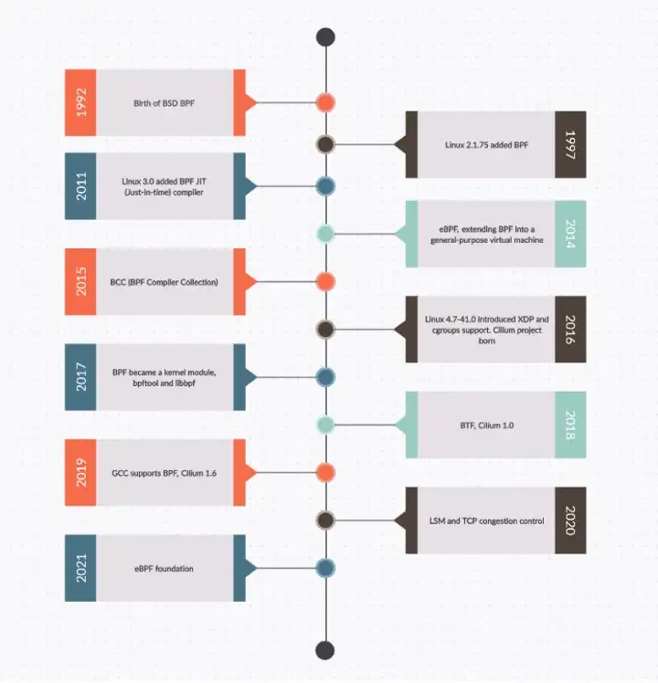
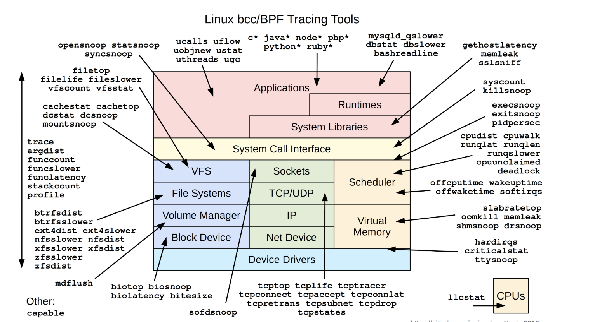
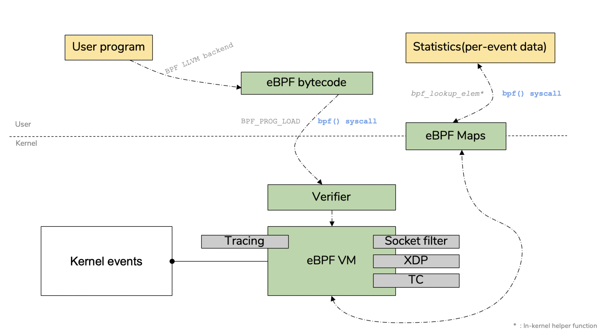
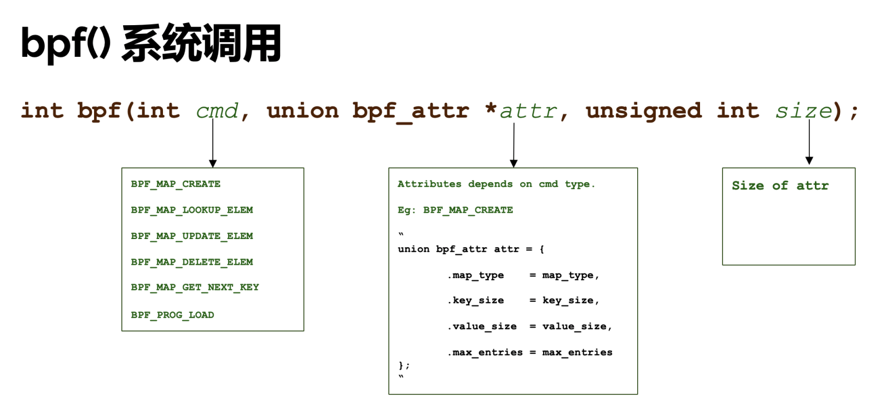

ebpf开发介绍

# 介绍
## 什么是eBPF
eBPF“Extended Berkeley Packet Filter” 它不仅仅是用于数据包过滤，它实际上是一个框架，允许用户在系统内核中加载和运行自定义程序。这意味着您将能够动态更改内核行为并且可能非常有用。

eBPF 提供了一种机制，可以在内核事件和用户程序事件发生时安全地注入代码，从而允许非内核开发人员也可以控制内核。

随着内核的发展，BPF从最初的包过滤逐渐扩展到网络、内核、安全、跟踪等，其功能特性仍在快速发展。这种扩展的BPF被称为eBPF（对应的，Early BPF被称为classic BPF，简称cBPF）。

在 eBPF 之前，内核模块是注入内核的主要机制。由于缺乏对内核模块的安全控制，内核的基本功能很容易被有缺陷的内核模块破坏。

另一方面，eBPF 借助即时编译器 (JIT) 在内核中运行一个虚拟机，确保只有经过验证安全的 eBPF 指令才会被内核执行。同时，由于eBPF指令仍然运行在内核中，不需要向用户态拷贝数据，大大提高了事件处理的效率。

正是由于这些突出的特点，eBPF被广泛应用于故障诊断、网络优化、安全控制、性能监控等领域。例如Meta开源的高性能网络负载均衡器Katran，Isovalent开源的容器网络解决方案Cilium，以及知名的内核跟踪调试工具BCC和bpftrace，都是基于eBPF技术实现的。

### eBPF历史

https://medium.com/geekculture/ebpf-part-one-next-gen-linux-kernel-devops-tool-9ab602bb70f7

BSD 包过滤器 (BPF)，比当时最先进的包过滤快 20 倍。这主要得益于BPF的两大设计：

内核模式：它引入了一个新的虚拟机，所有指令都在内核虚拟机中运行。
用户态：它使用BPF字节码定义过滤表达式，然后传递给内核，由内核虚拟机解释执行。

2014 年，为了研究新的软件定义网络解决方案，Alexei Starovoitov 对 BPF 进行了第一次革命性更新，将 BPF 扩展为通用虚拟机 eBPF。eBPF不仅扩展了寄存器数量，引入了新的BPF map存储，还在4.x内核中将原来单一的包过滤事件逐步扩展为内核态函数、用户态函数、trace点和性能事件（perf_events） . 和安全控制。这是 BPF 历史上的一个转折点，使得 BPF 不再局限于网络栈，而是内核的顶层子系统。

此后，bpftraceiovisor 带来的 BCC 等工具成为 eBPF 在跟踪和故障排除领域的最佳实践。也逐渐诞生了Cilium、Katran、Falco等一系列基于eBPF优化网络和安全的开源项目。

越来越多的开源和商业解决方案正在使用 eBPF 来优化他们的网络、安全性和观察性能。例如，最流行的网络解决方案之一的 Calico，在最近的版本中引入了 eBPF 数据平面网络，极大地提升了网络的性能。

初出茅庐的BPF在几年的时间里崭露头角，迅速的获得了大量公司、社区的簇拥。 Linux社区计划使用BPF重新实现iptables； Facebook使用BPF做负载均衡器，抵御DDoS攻击；Netflix使用BPF进行程序的tracing和profiling；P4，Open vSwitch正在考虑使用BPF；CETH, Cilium则是完全基于BPF设计的，Cilium还利用BPF实现了一些激动人心的优化。


下图展示了 eBPF 的时间线：


## 基于eBPF的工具
### BCC
BCC(BPF Compiler Collection) 在 eBPF 编程接口之上封装了 eBPF 程序的构建过程，提供了 Python、C++ 和 Lua 等高级语言接口，并基于 Python 接口实现了大量的工具，是新手入门体验 eBPF 的最好项目。
BCC自带的工具如下：


### bpftrace
bpftrace 类似于 DTrace 或 SystemTap，它在 eBPF 之上构建了一个简化的跟踪语言，通过简单的几行脚本，就可以达到复杂的跟踪功能。多行的跟踪指令也可以放到脚本文件中执行，脚本后缀通常为 .bt。

### kubectl-trace 基于bpftrace 的kubernetes 集群性能分析工具
kubectl-trace 是一个kubectl 的插件，我们可以使用基于bpftrace 的编程能力，来分析系统的性能问题， 


## eBPF架构
eBPF被分为两部分: 用户空间程序 和 内核程序
* 用户空间程序负责将 BPF 字节码加载到内核汇总，如果需要，还负责读取内核返回的统计信息或事件详细信息
* 内核中的BPF字节码负责执行内核中的特定事件，并且在需要时通过映射(maps)或者 perf-event 事件将结果发送到用户空间
* 用户空间程序可以通过 map 结构与内核BPF字节码程序进行双向通信，这为在内核中运行的BPF字节码程序提供了更为灵活的控制


用户空间程序和内核中BPF字节码的交互流程:

* 使用 LLVM 或 GCC 工具将编写好的 BPF 代码程序编译成 BPF 字节码
* 使用加载器将字节码加载到内核中
* 内核使用 Verfier 组件来保护字节码的执行，避免给内核带来灾难，并在确认其安全后将字节码加载到相应的内核模块中执行
* 在内核中运行的 BPF 字节码程序可以使用两种方式将数据发送回用户空间
  * maps 方法可用于将内核中实现的统计摘要信息（例如测量延迟、堆栈信息）等传回用户空间
  * perf-event 用于将内核收集的事件实时发送到用户空间，由用户空间程序实时读取和分析
  
## eBPF限制
虽然eBPF功能强大，但是内核中的eBPF技术还是使用了很多限制以确保内核处理的安全和及时。但是随着技术的发展和演进，这些限制可能会逐步放宽或者提供了相应的解决方案:

* eBPF程序并不能随意调用内核参数，而是仅仅限制在内核模块列出的 BPF Helper 函数。不过这个支持函数列表随着内核发展而增长
* eBPF 程序不允许包含无法访问的指令，以防止加载无效代码和延迟程序终止
* eBPF 程序中的循环数量是有限的，并且必须在有限的时间内结束，这主要用于防止在 kprobes 中插入任意循环，从而导致锁定整个系统
  * 解决方案包括扩展循环和为需要循环的常见用途添加辅助函数
  * Linux 5.3 在 BPF 中包含对有界循环的支持，它在运行时具有可验证的上限
* eBPF 堆栈大小限制为 MAX_BPF_STACK ，这个值从内核5.8开始设置为 512 ; 详细参考 include/linux/filter.h
  * 当在堆栈上存储多个字符串缓冲区时，此限制特别相关: 一个 char[256] 缓冲区将消耗此堆栈的一半
  * 注意: 没有增加这个限制的计划 – 解决方案是切换到 bpf 映射存储，这实际上是无限的
* eBPF字节码大小最初限制为 4096 条指令，但从内核 Linux 5.8 开始，现在已经放宽到 100 万条指令（ BPF_COMPLEXITY_LIMIT_INSNS ）详细参考 include/linux/bpf.h
  * 4096 条指令限制（ BPF_MAXINSNS ）仍然是 保留给非特权 BPF 程序
  * 新版本的eBPF还支持级联调用多个eBPF程序(不过传递信息方面存在一定限制)，可以组合起来实现更多强大功能

# 调用eBPF 
## 调用内核函数、跟踪点和事件
### 列出内核函数、内核跟踪点或性能事件
* 使用调试信息获取内核函数、内核跟踪点
```bash
sudo ls /sys/kernel/debug/tracing/events
```

* 使用 bpftrace 获取内核函数、内核跟踪点
```bash
# 查询所有内核插桩和跟踪点
sudo bpftrace -l

# 使用通配符查询所有的系统调用跟踪点
sudo bpftrace -l 'tracepoint:syscalls:*'

# 使用通配符查询所有名字包含"open"的跟踪点
sudo bpftrace -l '*open*'
```

* 使用 perf list 获取性能事件
```bash
sudo perf list tracepoint
```

### 获取内核函数、跟踪点、事件调用方式
* 使用调试信息获取
```
sudo cat /sys/kernel/debug/tracing/events/syscalls/sys_enter_openat/format
```
* 使用 bpftrace 获取
```bash
sudo bpftrace -lv tracepoint:syscalls:sys_enter_openat
```

## 跟踪用户进程
### 获取跟踪点
* 获取调试信息。静态编译语言通过-g 编译选项保留调试信息，应用程序二进制会包含 DWARF（Debugging With Attributed Record Format），有了调试信息，可以通过  readelf、objdump、nm 等工具，查询可用于跟踪的函数、变量等符号列表
```bash
# 查询符号表
readelf -Ws /usr/lib/x86_64-linux-gnu/libc.so.6
# 查询USDT信息
readelf -n /usr/lib/x86_64-linux-gnu/libc.so.6
```

* 使用 bpftrace
```bash
# 查询uprobe
bpftrace -l 'uprobe:/usr/lib/x86_64-linux-gnu/libc.so.6:*'

# 查询USDT
bpftrace -l 'usdt:/usr/lib/x86_64-linux-gnu/libc.so.6:*'
```

**uprobe 是基于文件的。当文件中的某个函数被跟踪时，除非对进程 PID 进行了过滤，默认所有使用到这个文件的进程都会被插桩。**

上面说的是静态编译语言，他和内核的跟踪类似，应用程序的符号信息可以存放在 ELF 二进制文件中，也可以以单独文件的形式，放到调试文件中；而内核的符号信息除了可以存放到内核二进制文件中之外，还会以  /proc/kallsyms  和  /sys/kernel/debug  等形式暴露到用户空间。

虽然内核社区已经对 BPF 做了很多的性能调优，跟踪用户态函数（特别是锁争用、内存分配之类的高频函数）还是有可能带来很大的性能开销。因此，我们在使用 uprobe 时，应该尽量避免跟踪高频函数。

## bpf () 系统调用


### bpf () 函数定义
使用 bpf() 系统调用和 BPF_PROG_LOAD 命令加载程序。该系统调用的原型为：
```c
int bpf(int cmd, union bpf_attr *attr, unsigned int size);
```


BPF_PROG_LOAD 加载的命令可以用于创建和修改 eBPF maps，maps 是普通的 key/value 数据结构，用于在 eBPF 程序和内核空间或用户空间之间通信。其他命令允许将 eBPF 程序附加到一个控制组目录或 socket 文件描述符上，迭代所有的 maps 和程序，以及将 eBPF 对象固定到文件，这样在加载 eBPF 程序的进程结束后不会被销毁 (后者由 tc 分类器 / 操作代码使用，因此可以将 eBPF 程序持久化，而不需要加载的进程保持活动状态)。完整的命令可以参考 bpf() 帮助文档。 

虽然可能存在很多不同的命令，但大体可以分为以下几类：与 eBPF 程序交互的命令、与 eBPF maps 交互的命令，或同时与程序和 maps 交互的命令(统称为对象)。

### eBPF 程序类型的作用

使用 BPF_PROG_LOAD 加载的程序类型确定了四件事：

* 附加程序的位置；
* 验证器允许调用的内核辅助函数；
* 是否可以直接访问网络数据报文；
* 传递给程序的第一个参数对象的类型。

实际上，程序类型本质上定义了一个 API。创建新的程序类型甚至纯粹是为了区分不同的可调用函数列表 (例如，BPF_PROG_TYPE_CGROUP_SKB 和 BPF_PROG_TYPE_SOCKET_FILTER)。

随着新程序类型的增加，内核开发人员也会发现需要添加新的数据结构。

### eBPF 数据结构
eBPF 使用的主要的数据结构是 eBPF map，这是一个通用的数据结构，用于在内核或内核和用户空间传递数据。其名称 "map" 也意味着数据的存储和检索需要用到 key。

使用 bpf() 系统调用创建和管理 map。当成功创建一个 map 后，会返回与该 map 关联的文件描述符。关闭相应的文件描述符的同时会销毁 map。每个 map 定义了四个值：类型，元素最大数目，数值的字节大小，以及 key 的字节大小。eBPF 提供了不同的 map 类型，不同类型的 map 提供了不同的特性。


以下将会列举一下常见的类型：
```js
BPF_MAP_TYPE_HASH : a hash table「哈希表」

BPF_MAP_TYPE_ARRAY : an array map, optimized for fast lookup speeds, often used for counters「数组映射，已针对快速查找速度进行优化，通常用于计数器」

BPF_MAP_TYPE_PROG_ARRAY : an array of file descriptors corresponding to eBPF programs; used to implement jump tables and sub-programs to handle specific packet protocols「对应 eBPF 程序的文件描述符数组；用于实现跳转表和子程序处理特定的数据包协议」

BPF_MAP_TYPE_PERCPU_ARRAY : a per-CPU array, used to implement histograms of latency「每个 CPU 的阵列，用于实现延迟的直方图」

BPF_MAP_TYPE_PERF_EVENT_ARRAY : stores pointers to struct perf_event, used to read and store perf event counters「存储指向 struct perf_event 的指针，用于读取和存储 perf 事件计数器」

BPF_MAP_TYPE_CGROUP_ARRAY : stores pointers to control groups「存储指向控制组的指针」

BPF_MAP_TYPE_PERCPU_HASH : a per-CPU hash table「每个 CPU 的哈希表」

BPF_MAP_TYPE_LRU_HASH : a hash table that only retains the most recently used items「仅保留最近使用项目的哈希表」

BPF_MAP_TYPE_LRU_PERCPU_HASH : a per-CPU hash table that only retains the most recently used items「每个 CPU 的哈希表，仅保留最近使用的项目」

BPF_MAP_TYPE_LPM_TRIE : a longest-prefix match trie, good for matching IP addresses to a range「最长前缀匹配数，适用于将 IP 地址匹配到某个范围」

BPF_MAP_TYPE_STACK_TRACE : stores stack traces「存储堆栈跟踪」

BPF_MAP_TYPE_ARRAY_OF_MAPS : a map-in-map data structure「map-in-map 数据结构」

BPF_MAP_TYPE_HASH_OF_MAPS : a map-in-map data structure「map-in-map 数据结构」

BPF_MAP_TYPE_DEVICE_MAP : for storing and looking up network device references「用于存储和查找网络设备引用」

BPF_MAP_TYPE_SOCKET_MA : stores and looks up sockets and allows socket redirection with BPF helper functions「存储和查找套接字，并允许使用 BPF 辅助函数进行套接字重定向」

```

所有的 map 都可以通过 eBPF 或在用户空间的程序中使用  bpf_map_lookup_elem()  和 bpf_map_update_elem() 函数进行访问。某些 map 类型，如 socket map，会使用其他执行特殊任务的 eBPF 辅助函数。 
```
bpftool feature probe
bpftool feature probe | grep map_type
```
eBPF 的更多细节可以参见官方帮助文档

### eBPF 辅助函数
eBPF 程序被触发时，会调用辅助函数。这些特别的函数让 eBPF 能够有访问内存的丰富功能。

可以参考官方帮助文档查看 libbpf 库提供的辅助函数。

官方文档给出了现有的 eBPF 辅助函数。更多的实例可以参见内核源码的 samples/bpf/ 和 tools/testing/selftests/bpf/ 目录。

# eBPF项目
 * Cilium  用于保护使用 Docker 和 Kubernetes 等 Linux 容器管理平台部署的应用程序服务之间的网络连接。
 * Falco 是一种行为分析工具，可以检测应用程序中的异常情况。
 * Teleport  证书颁发机构和基础架构的访问平面。它允许用户在一个地方设置单点登录并访问 SSH 服务器、K8s 和 Web 应用程序。Teleport 的重要功能之一是共享交互式会话。Teleport 4.2 版本开始使用一些 eBPF 程序来捕获 SSH 会话并将它们转换为事件流。
 * Katran 是一个开源的 eBPF 项目，用于构建高性能的第 4 层负载均衡转发平面。Katran 于 2018 年 5 月由 Facebook 开源。
 * Pixie 性能监控工具，使用 eBPF 定期中断 CPU。在此过程中，eBPF 探针会检查当前正在运行的程序并收集堆栈跟踪以记录程序在何处执行。

eBPF 无疑彻底改变了网络、负载平衡和安全领域。我很确定很多人都在关注这项技术，并将能够用它做更多的事情。

# 项目
## 持续性能分析
* Parca — 具有强大的 Prometheus 根基，基于 eBPF，适用于单节点和 Kubernetes 环境。基于 Prometheus 标签和服务发现概念，易于设置和使用。https://www.parca.dev/
* Pixie — 基于 eBPF 的一体式 o11y 解决方案，除其他外，提供分析。功能强大，可以编写自己的 eBPF 程序，专注于 Kubernetes。https://px.dev/
* Pyroscope — 具有广泛的语言支持（Java、Ruby、Python、.NET 等）、eBPF 集成和高级可视化。 https://pyroscope.io/

## 监控
* Tetragon 的基石是一个强大的可观测层，它可以观测整个系统，从低级别的内核可见性到跟踪文件访问、网络活动或能力（capability）变化，一直到应用层，涵盖了诸如对易受攻击的共享库的函数调用、跟踪进程执行或解析发出的 HTTP 请求。总的来说，Tetragon 可以提供对各种内核子系统的可观测性，涵盖了命名空间逃逸、Capabilities 和特权升级、文件系统和数据访问、HTTP、DNS、TLS 和 TCP 等协议的网络活动，以及系统调用层的事件，以审计系统调用和跟踪进程执行。 https://icloudnative.io/posts/tetragon/
* Levo是一种专门构建的、开发人员优先的 API 安全解决方案，可在 CI/CD 管道中完全自动化 API 可观察性、API 文档和 API 测试 https://towardsdev.com/auto-openapi-generation-the-network-doesnt-lie-5ca6625a9b5c
* tracee 使用ebpf进行安全检测： https://www.cnblogs.com/janeysj/p/16254048.html


# TODO
* K8S项目引入Cilium 发现的问题, https://blog.deckhouse.io/cilium-support-in-deckhouse-kubernetes-342fcf3da56
* ebpf引入服务网格的考虑（优点），https://medium.com/geekculture/istio-ebpf-and-rsocket-broker-a-deep-dive-into-service-mesh-7ec4871d50bb

# ref

 * ebpf 编程 https://www.ebpf.top/what-is-ebpf/content/3.ebpf-programs.html
 * bcc与bpftrace介绍,以及使用kubectl trace跟踪K8S https://feisky.xyz/posts/2021-01-27-ebpf-hello/
 * bpftrace 跟踪例子： https://www.51cto.com/article/700064.html
 * bpftrace 跟踪例子： https://blog.51cto.com/proware/6028057
